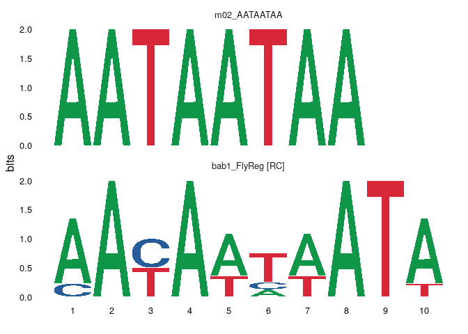
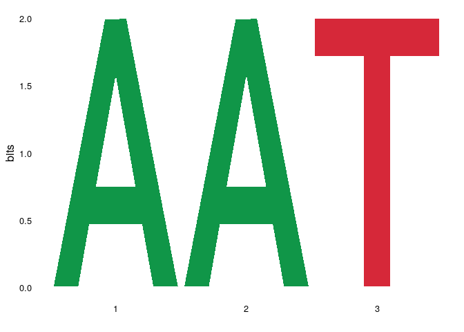
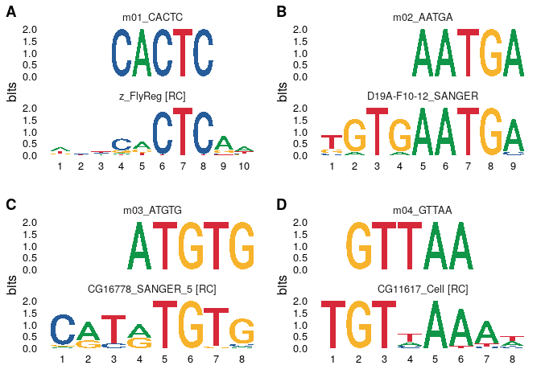
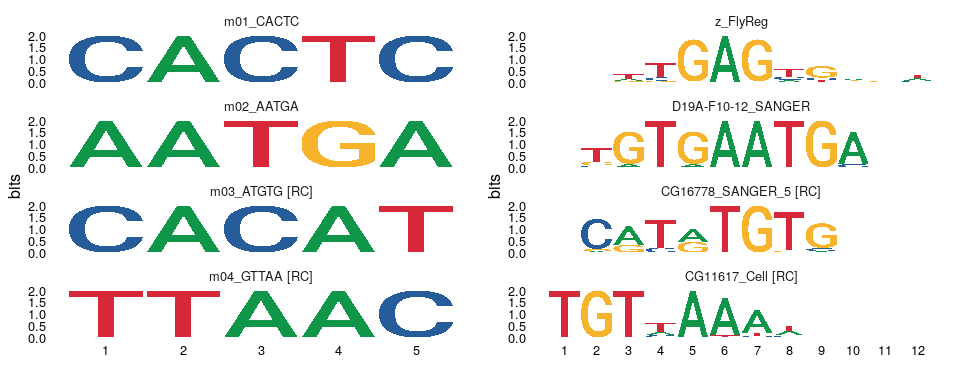
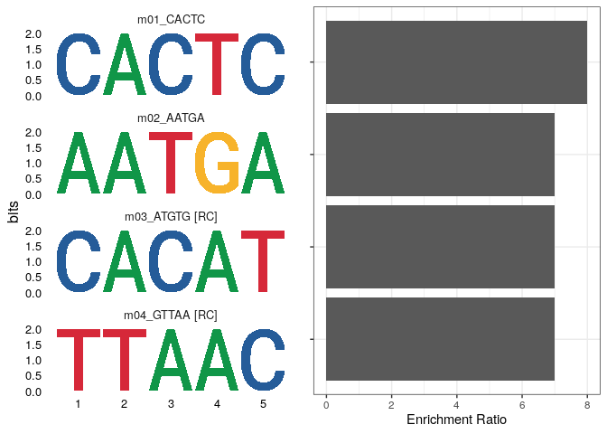
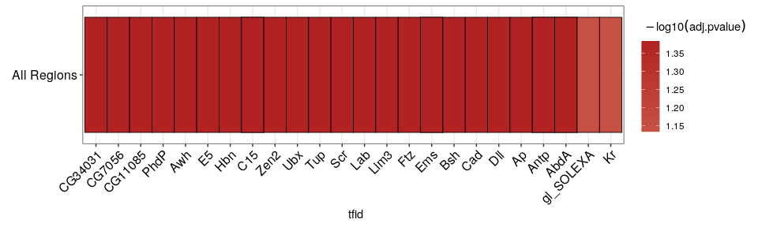

<!-- README.md is generated from README.Rmd. Please edit that file -->

# dremeR

<!-- badges: start -->

[](https://www.tidyverse.org/lifecycle/#experimental)
[](https://www.repostatus.org/#wip)
<!-- badges: end -->

An R interface to the [MEME Suite](http://meme-suite.org/) family of
tools.

## Installation

You can install the development version of dremeR from
[GitHub](https://github.com/) with:

``` r
# install.packages("remotes")
remotes::install_github("snystrom/dotargs")
remotes::install_github("snystrom/dremeR")
```

## Example

``` r
library(dremeR)

# Verify that dremeR detects your meme install
# should return all green checks if so.
check_meme_install()
#> checking main install
#> ✔ /nas/longleaf/home/snystrom/meme/bin
#> checking util installs
#> ✔ /nas/longleaf/home/snystrom/meme/bin/dreme
#> ✔ /nas/longleaf/home/snystrom/meme/bin/ame
#> ✔ /nas/longleaf/home/snystrom/meme/bin/fimo
#> ✔ /nas/longleaf/home/snystrom/meme/bin/tomtom
```

``` r
fa <- dremeR:::duplicate_file("inst/extdata/fasta_ex/fa1.fa")
dreme_out <- runDreme(fa, "shuffle", e = 39)
#> Registered S3 method overwritten by 'treeio':
#>   method     from
#>   root.phylo ape
```

dreme results are a `data.frame`. The `motif` column contains a
`universalmotif` object with the PCM information for each *de-novo*
discovered motif. This is so that any filtering of the results object
also simply filter the available motifs.

``` r
dreme_out
#>   rank           id     alt      seq length nsites positive_hits negative_hits
#> 1    1      m01_AAA DREME-1      AAA      3      5             1             1
#> 2    2 m02_AATAATAA DREME-2 AATAATAA      8     10             1             0
#> 3    3      m03_AAT DREME-3      AAT      3     10             1             1
#>   pvalue evalue unerased_evalue positive_total negative_total pos_frac neg_frac
#> 1    1.0     39              39              1              1        1        1
#> 2    0.5      9              18              1              1        1        0
#> 3    1.0     12              12              1              1        1        1
#>                                                                  motif
#> 1 <S4 class 'universalmotif' [package "universalmotif"] with 20 slots>
#> 2 <S4 class 'universalmotif' [package "universalmotif"] with 20 slots>
#> 3 <S4 class 'universalmotif' [package "universalmotif"] with 20 slots>
```

``` r
library(universalmotif)

view_motifs(dreme_out$motif)
```

<!-- --> The primary
advantage of using the `data.frame` output allows simple integration
with base subsetting, piping, and the `tidyverse`.

``` r
library(dplyr)
#> 
#> Attaching package: 'dplyr'
#> The following objects are masked from 'package:stats':
#> 
#>     filter, lag
#> The following objects are masked from 'package:base':
#> 
#>     intersect, setdiff, setequal, union

dreme_out %>% 
  filter(length == 3) %>% 
  {universalmotif::view_motifs(.$motif)}
```

<!-- -->

`universalmotif` manipulations can easily be executed on data.frame
columns. For example:

``` r
dreme_out$motif %>% 
  merge_motifs() %>% 
  view_motifs()
```

<!-- -->

## TomTom

TomTom can be used to match *de-novo* motifs from dreme to a database of
known motifs. If run on the output of `runDreme` it will append
information for the best match in columns prefixed `best_`. Secondary
matches found by tomtom will be stored in the list column
`tomtom`.

``` r
full_res <- runTomTom(dreme_out, database = "inst/extdata/db/fly_factor_survey_id.meme")
```

``` r
full_res
#>   rank           id     alt      seq length nsites positive_hits negative_hits
#> 1    1      m01_AAA DREME-1      AAA      3      5             1             1
#> 2    2 m02_AATAATAA DREME-2 AATAATAA      8     10             1             0
#> 3    3      m03_AAT DREME-3      AAT      3     10             1             1
#>   pvalue evalue unerased_evalue positive_total negative_total pos_frac neg_frac
#> 1    1.0     39              39              1              1        1        1
#> 2    0.5      9              18              1              1        1        0
#> 3    1.0     12              12              1              1        1        1
#>                                                                  motif
#> 1 <S4 class 'universalmotif' [package "universalmotif"] with 20 slots>
#> 2 <S4 class 'universalmotif' [package "universalmotif"] with 20 slots>
#> 3 <S4 class 'universalmotif' [package "universalmotif"] with 20 slots>
#>   best_match_id best_match_alt best_match_pvalue best_match_evalue
#> 1          <NA>           <NA>                NA                NA
#> 2   bab1_FlyReg    FBgn0004870          0.000287             0.174
#> 3          <NA>           <NA>                NA                NA
#>   best_match_qvalue         best_db_name
#> 1                NA                 <NA>
#> 2             0.326 fly_factor_survey_id
#> 3                NA                 <NA>
#>                                                       best_match_motif
#> 1                                                                 NULL
#> 2 <S4 class 'universalmotif' [package "universalmotif"] with 20 slots>
#> 3                                                                 NULL
#>                                                                                                                                                                                                                                                                                                                                                                                                                                                                                                                                                                                                                                                                                                                                                                                                                                                                                                                                                                                                                                                                                                                                                                                                                                                                                                                                                                                                                                                                                                                                                                                               tomtom
#> 1                                                                                                                                                                                                                                                                                                                                                                                                                                                                                                                                                                                                                                                                                                                                                                                                                                                                                                                                                                                                                                                                                                                                                                                                                                                                                                                                                                                                                                                                                                                                                                                               NULL
#> 2 bab1_FlyReg, ap_FlyReg, Pph13_Cell, jigr1_SANGER_5, So_Cell, Antp_FlyReg, br-Z4_FlyReg, hb_FlyReg, zen_FlyReg, Hgtx_SOLEXA, eve_FlyReg, FBgn0004870, FBgn0000099_2, FBgn0023489, FBgn0039350, FBgn0003460, FBgn0000095_2, FBgn0000210_4, FBgn0001180_2, FBgn0004053_2, FBgn0040318_2, FBgn0000606_2, 0.000287, 0.00413, 0.00419, 0.00431, 0.00657, 0.00825, 0.0086, 0.0102, 0.012, 0.0145, 0.0164, 0.174, 2.51, 2.55, 2.62, 4, 5.02, 5.23, 6.18, 7.31, 8.84, 9.99, 0.326, 0.592, 0.592, 0.592, 0.592, 0.592, 0.592, 0.592, 0.592, 0.592, 0.592, fly_factor_survey_id, fly_factor_survey_id, fly_factor_survey_id, fly_factor_survey_id, fly_factor_survey_id, fly_factor_survey_id, fly_factor_survey_id, fly_factor_survey_id, fly_factor_survey_id, fly_factor_survey_id, fly_factor_survey_id, <S4 class 'universalmotif' [package "universalmotif"] with 20 slots>, <S4 class 'universalmotif' [package "universalmotif"] with 20 slots>, <S4 class 'universalmotif' [package "universalmotif"] with 20 slots>, <S4 class 'universalmotif' [package "universalmotif"] with 20 slots>, <S4 class 'universalmotif' [package "universalmotif"] with 20 slots>, <S4 class 'universalmotif' [package "universalmotif"] with 20 slots>, <S4 class 'universalmotif' [package "universalmotif"] with 20 slots>, <S4 class 'universalmotif' [package "universalmotif"] with 20 slots>, <S4 class 'universalmotif' [package "universalmotif"] with 20 slots>, <S4 class 'universalmotif' [package "universalmotif"] with 20 slots>, <S4 class 'universalmotif' [package "universalmotif"] with 20 slots>
#> 3                                                                                                                                                                                                                                                                                                                                                                                                                                                                                                                                                                                                                                                                                                                                                                                                                                                                                                                                                                                                                                                                                                                                                                                                                                                                                                                                                                                                                                                                                                                                                                                               NULL
```

``` r
full_res$tomtom
#> [[1]]
#> NULL
#> 
#> [[2]]
#>          match_id     match_alt match_pvalue match_evalue match_qvalue
#> 1     bab1_FlyReg   FBgn0004870     0.000287        0.174        0.326
#> 2       ap_FlyReg FBgn0000099_2     0.004130        2.510        0.592
#> 3      Pph13_Cell   FBgn0023489     0.004190        2.550        0.592
#> 4  jigr1_SANGER_5   FBgn0039350     0.004310        2.620        0.592
#> 5         So_Cell   FBgn0003460     0.006570        4.000        0.592
#> 6     Antp_FlyReg FBgn0000095_2     0.008250        5.020        0.592
#> 7    br-Z4_FlyReg FBgn0000210_4     0.008600        5.230        0.592
#> 8       hb_FlyReg FBgn0001180_2     0.010200        6.180        0.592
#> 9      zen_FlyReg FBgn0004053_2     0.012000        7.310        0.592
#> 10    Hgtx_SOLEXA FBgn0040318_2     0.014500        8.840        0.592
#> 11     eve_FlyReg FBgn0000606_2     0.016400        9.990        0.592
#>                 db_name
#> 1  fly_factor_survey_id
#> 2  fly_factor_survey_id
#> 3  fly_factor_survey_id
#> 4  fly_factor_survey_id
#> 5  fly_factor_survey_id
#> 6  fly_factor_survey_id
#> 7  fly_factor_survey_id
#> 8  fly_factor_survey_id
#> 9  fly_factor_survey_id
#> 10 fly_factor_survey_id
#> 11 fly_factor_survey_id
#>                                                             match_motif
#> 1  <S4 class 'universalmotif' [package "universalmotif"] with 20 slots>
#> 2  <S4 class 'universalmotif' [package "universalmotif"] with 20 slots>
#> 3  <S4 class 'universalmotif' [package "universalmotif"] with 20 slots>
#> 4  <S4 class 'universalmotif' [package "universalmotif"] with 20 slots>
#> 5  <S4 class 'universalmotif' [package "universalmotif"] with 20 slots>
#> 6  <S4 class 'universalmotif' [package "universalmotif"] with 20 slots>
#> 7  <S4 class 'universalmotif' [package "universalmotif"] with 20 slots>
#> 8  <S4 class 'universalmotif' [package "universalmotif"] with 20 slots>
#> 9  <S4 class 'universalmotif' [package "universalmotif"] with 20 slots>
#> 10 <S4 class 'universalmotif' [package "universalmotif"] with 20 slots>
#> 11 <S4 class 'universalmotif' [package "universalmotif"] with 20 slots>
#> 
#> [[3]]
#> NULL
```

``` r
full_res %>% 
  dplyr::select(id, alt, seq, best_match_id, best_match_pvalue, best_match_evalue, best_match_motif)
#>             id     alt      seq best_match_id best_match_pvalue
#> 1      m01_AAA DREME-1      AAA          <NA>                NA
#> 2 m02_AATAATAA DREME-2 AATAATAA   bab1_FlyReg          0.000287
#> 3      m03_AAT DREME-3      AAT          <NA>                NA
#>   best_match_evalue
#> 1                NA
#> 2             0.174
#> 3                NA
#>                                                       best_match_motif
#> 1                                                                 NULL
#> 2 <S4 class 'universalmotif' [package "universalmotif"] with 20 slots>
#> 3                                                                 NULL
```

``` r
full_res$best_match_motif
#> [[1]]
#> NULL
#> 
#> [[2]]
#> 
#>        Motif name:   bab1_FlyReg
#>    Alternate name:   FBgn0004870
#>          Alphabet:   DNA
#>              Type:   PCM
#>           Strands:   +-
#>          Total IC:   14.61
#>         Consensus:   TATWAWTRTT
#>      Target sites:   6
#> 
#>   T A T W A W T R T T
#> A 1 6 0 2 4 2 0 3 0 0
#> C 0 0 0 0 0 0 0 0 0 0
#> G 0 0 0 0 1 0 0 3 0 1
#> T 5 0 6 4 1 4 6 0 6 5
#> 
#> [[3]]
#> NULL

view_tomtom_hits(full_res, 1)
#> [[1]]
```

<!-- -->

    #> 
    #> [[2]]

<!-- -->

    #> 
    #> [[3]]

<!-- -->

## Denovo Motif Pipeline w/ dremer

``` r
suppressPackageStartupMessages(library(GenomicRanges))

peaks <- "inst/extdata/peaks/peaks.tsv" %>%
  readr::read_tsv() %>%
  GRanges
```

``` r
dm.genome <- BSgenome.Dmelanogaster.UCSC.dm6::BSgenome.Dmelanogaster.UCSC.dm6
options(meme_db = "inst/extdata/db/fly_factor_survey_id.meme")

motif_analysis <- peaks %>% 
  resize(200, "center") %>% 
  get_sequence(dm.genome) %>% 
  runDreme("shuffle", e = 50) %>% 
  runTomTom()
```

## Compare denovo motif with best match

use `cowplot` to arrange plots in a grid.

``` r
view_tomtom_hits(motif_analysis, 1) %>% 
  cowplot::plot_grid(plotlist = ., labels = "AUTO")
```

<!-- -->

## Evaluate top 3 hits from TOMTOM

``` r
view_tomtom_hits(motif_analysis, 3)
#> [[1]]
```

<!-- -->

    #> 
    #> [[2]]

<!-- -->

    #> 
    #> [[3]]

<!-- -->

    #> 
    #> [[4]]

<!-- -->

``` r
library(ggplot2)

frac_plot <- motif_analysis %>% 
  ggplot(aes(reorder(id, pos_frac), pos_frac/neg_frac)) +
    geom_col() + 
    coord_flip() +
    labs(x = NULL,
         y = "Enrichment Ratio") +
    theme_bw() +
    theme(axis.text.y = element_blank())
```

``` r
cowplot::plot_grid(
  universalmotif::view_motifs(motif_analysis$motif),
  frac_plot
)
```

<!-- -->

## Motif scanning & enrichment testing with AME

``` r
ame_analysis <- peaks %>% 
  resize(200, "center") %>% 
  get_sequence(dm.genome) %>% 
  runAme(evalue_report_threshold = 50)
```

``` r
ame_analysis %>% 
  ame_plot_heatmap()
```

<!-- -->

### Example for converting gene ids

Try using `annotationDbi::mapIds` instead. Also, note below E93 Fbgn is
out of date & does not map.

``` r
ame_analysis$motif_alt_id %>% 
  gsub("_.+", "", .) %>% 
  clusterProfiler::bitr(fromType = "FLYBASE", toType = "SYMBOL", OrgDb = org.Dm.eg.db::org.Dm.eg.db)
#> 
#> Registered S3 method overwritten by 'enrichplot':
#>   method               from
#>   fortify.enrichResult DOSE
#> 
#> 'select()' returned 1:1 mapping between keys and columns
#> Warning in clusterProfiler::bitr(., fromType = "FLYBASE", toType = "SYMBOL", :
#> 25% of input gene IDs are fail to map...
#>       FLYBASE SYMBOL
#> 2 FBgn0000286    Cf2
#> 3 FBgn0263108 BtbVII
#> 4 FBgn0013263    Trl
```

### reducing best matches from ame

``` r

ame_analysis %>% 
  dplyr::group_by(motif_id) %>% 
  dplyr::filter(adj.pvalue == min(adj.pvalue)) %>% 
  dplyr::ungroup()
#> # A tibble: 4 x 17
#>    rank motif_db motif_id motif_alt_id consensus  pvalue adj.pvalue evalue tests
#>   <int> <chr>    <chr>    <chr>        <chr>       <dbl>      <dbl>  <dbl> <int>
#> 1     1 inst/ex… Eip93F_… FBgn0013948  ACWSCCRA… 5.14e-4     0.0339   20.6    67
#> 2     2 inst/ex… Cf2-PB_… FBgn0000286… CSSHNKDT… 1.57e-3     0.04     24.3    26
#> 3     3 inst/ex… BtbVII_… FBgn0263108  MBTATGTA… 4.30e-4     0.0697   42.4   168
#> 4     4 inst/ex… Trl_Fly… FBgn0013263  YYKCTCTC… 2.37e-4     0.0784   47.7   344
#> # … with 8 more variables: fasta_max <dbl>, pos <int>, neg <int>,
#> #   pwm_min <dbl>, tp <int>, tp_percent <dbl>, fp <int>, fp_percent <dbl>
```

### Ame in partitioning mode

``` r
ame_partition <- peaks %>% 
  data.frame %>% 
  # NOTE: never actually do this, just a quick way to generate example data
  dplyr::mutate(score = seq_along(start)) %>% 
  GRanges %>% 
  resize(200, "center") %>% 
  get_sequence(dm.genome, score = "score") %>% 
  runAme(control = NA, evalue_report_threshold = 50)
```

``` r
ame_partition %>% 
  dplyr::mutate(tfid = gsub("(.+)_{1}.+", "\\1", motif_id)) %>% 
  ame_plot_heatmap(id = tfid)
```

<!-- -->

### Dotargs backend & error checking

``` r
ame_analysis <- peaks %>% 
  resize(200, "center") %>% 
  get_sequence(dm.genome) %>% 
  runAme(evalue_reportt_threshold = 30)
```

    #> Error: Invalid flags. Did you mean: "evalue_report_threshold" instead of: "evalue_reportt_threshold"
