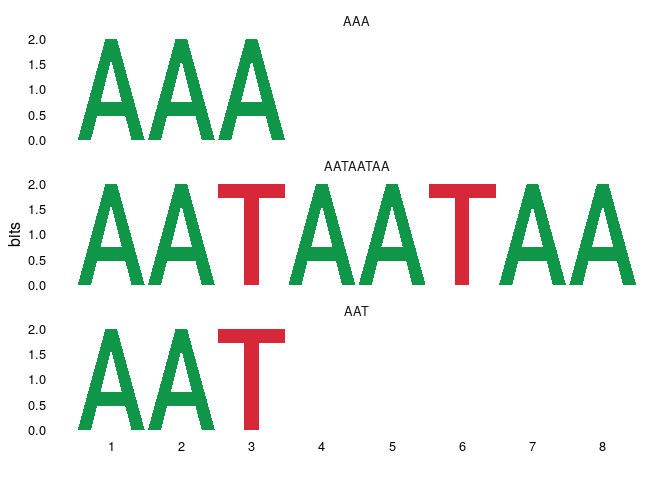
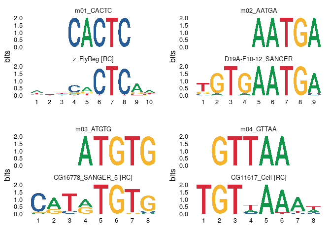
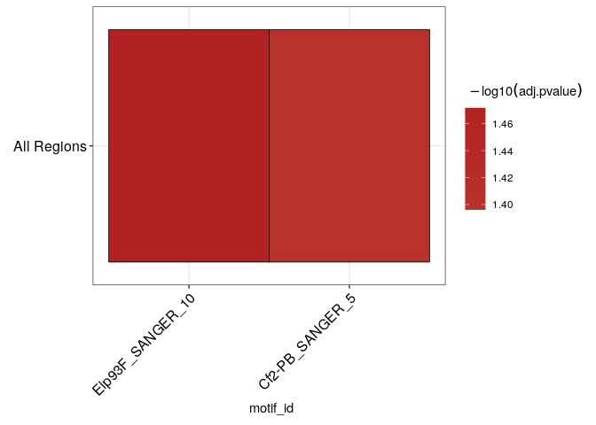

<!-- README.md is generated from README.Rmd. Please edit that file -->

# dremeR

<!-- badges: start -->

[](https://www.tidyverse.org/lifecycle/#experimental)
[](https://www.repostatus.org/#wip)
<!-- badges: end -->

An R interface to the [MEME Suite](http://meme-suite.org/) family of
tools.

## Installation

### Development Version

You can install the development version of dremeR from
[GitHub](https://github.com/snystrom/dremeR) with:

``` r
# install.packages("remotes")
remotes::install_github("snystrom/dremeR")
```

## Detecting the MEME Suite

dremeR relies on a local install of the [MEME
Suite](http://meme-suite.org/). For installation instructions for the
MEME suite, see the [MEME Suite Installation
Guide](http://meme-suite.org/doc/install.html?man_type=web).

dremeR needs to know the location of the `meme/bin/` directory on your
local machine. You can tell dremeR the location of your MEME suite
install in 4 ways. dremeR will always prefer the more specific
definition if it is a valid path. Here they are ranked from most- to
least-specific:

1.  Manually passing the install path to the `meme_path` argument of all
    dremeR functions
2.  Setting the path using `options(meme_bin = "/path/to/meme/bin/")`
    inside your R script
3.  Setting `MEME_BIN=/path/to/meme/bin/` in your `.Renviron` file
4.  dremeR will try the default MEME install location `~/meme/bin/`

If dremeR fails to detect your install at the specified location, it
will fall back to the next option.

To verify dremeR can detect your MEME install, use
`check_meme_install()` which uses the search herirarchy above to find a
valid MEME install. It will report whether any tools are missing, and
print the path to MEME that it sees. This can be useful for
troubleshooting issues with your install.

``` r
library(dremeR)

# Verify that dremeR detects your meme install
# (returns all green checks if so)
# (I have MEME installed to the default location)
check_meme_install()
#> checking main install
#> ✔ /nas/longleaf/home/snystrom/meme/bin
#> checking util installs
#> ✔ /nas/longleaf/home/snystrom/meme/bin/dreme
#> ✔ /nas/longleaf/home/snystrom/meme/bin/ame
#> ✔ /nas/longleaf/home/snystrom/meme/bin/fimo
#> ✔ /nas/longleaf/home/snystrom/meme/bin/tomtom
```

``` r
# You can manually input a path to meme_path
# If no meme/bin is detected, will return a red X
check_meme_install(meme_path = 'bad/path')
#> checking main install
#> ✖ bad/path
```

## The Core Tools

  - `runDreme()`
  - `runAme()`
  - `runTomTom()`
  - `runFimo()`

dremeR is built around the [universalmotif
package](https://www.bioconductor.org/packages/release/bioc/html/universalmotif.html)
which provides a framework for manipulating motifs in R.

### Motif Discovery with DREME

``` r
library(magrittr)
library(GenomicRanges)
#> Loading required package: stats4
#> Loading required package: BiocGenerics
#> Loading required package: parallel
#> 
#> Attaching package: 'BiocGenerics'
#> The following objects are masked from 'package:parallel':
#> 
#>     clusterApply, clusterApplyLB, clusterCall, clusterEvalQ,
#>     clusterExport, clusterMap, parApply, parCapply, parLapply,
#>     parLapplyLB, parRapply, parSapply, parSapplyLB
#> The following objects are masked from 'package:stats':
#> 
#>     IQR, mad, sd, var, xtabs
#> The following objects are masked from 'package:base':
#> 
#>     anyDuplicated, append, as.data.frame, basename, cbind, colnames,
#>     dirname, do.call, duplicated, eval, evalq, Filter, Find, get, grep,
#>     grepl, intersect, is.unsorted, lapply, Map, mapply, match, mget,
#>     order, paste, pmax, pmax.int, pmin, pmin.int, Position, rank,
#>     rbind, Reduce, rownames, sapply, setdiff, sort, table, tapply,
#>     union, unique, unsplit, which, which.max, which.min
#> Loading required package: S4Vectors
#> 
#> Attaching package: 'S4Vectors'
#> The following object is masked from 'package:base':
#> 
#>     expand.grid
#> Loading required package: IRanges
#> Loading required package: GenomeInfoDb

# Transcription factor peaks
peaks <- readr::read_tsv(system.file("extdata/peaks/peaks.tsv", package = "dremeR")) %>% 
  GRanges
#> Parsed with column specification:
#> cols(
#>   seqnames = col_character(),
#>   start = col_double(),
#>   end = col_double()
#> )

# Genome object
dm.genome <- BSgenome.Dmelanogaster.UCSC.dm6::BSgenome.Dmelanogaster.UCSC.dm6
```

``` r
sequences <- peaks %>% 
  resize(200, "center") %>% 
  get_sequence(dm.genome)
```

`runDreme` accepts DNAStringSet or a path to a fasta file as input. You
can use other sequences or shuffled input sequences as the control
dataset.

``` r
# runDreme accepts all arguments that the commandline version of dreme accepts
# here I set e = 50 to detect motifs in the limited example peak list
dreme_results <- runDreme(sequences, control = "shuffle", e = 50)
#> Registered S3 method overwritten by 'treeio':
#>   method     from
#>   root.phylo ape
```

dremeR is built around the
[universalmotif](https://www.bioconductor.org/packages/release/bioc/html/universalmotif.html)
package. The runDreme results object includes a `motif` column of
`universalmotif` objects which can be used in all `universalmotif`
functions.

``` r
library(universalmotif)
view_motifs(dreme_results$motif)
```

<!-- -->

### Matching motifs using TOMTOM

Discovered motifs can be matched to known TF motifs using `runTomTom`,
which can accept as input a path to a .meme formatted file, a
`universalmotif` list, or the results of `runDreme`.

TomTom uses a database of known motifs which can be passed to the
`database` parameter as a path to a .meme format file, or a
`universalmotif` object.

Optionally, you can set the environment variable `MEME_DB` in
`.Renviron`, or the `meme_db` value in `options` to a valid .meme format
file and dremeR will use that file as the database. dremeR will always
prefer user input to the function
call.

``` r
options(meme_db = system.file("extdata/db/fly_factor_survey_id.meme", package = "dremeR"))
m <- create_motif("CMATTACN", altname = "testMotif")
tomtom_results <- runTomTom(m)
```

``` r
tomtom_results
#>      id       alt family organism consensus alphabet strand icscore nsites
#> 1 motif testMotif   <NA>     <NA>  CMATTACN      DNA     +-      13     NA
#>   bkgsites pval qval eval
#> 1       NA   NA   NA   NA
#>                                                                  motif
#> 1 <S4 class 'universalmotif' [package "universalmotif"] with 20 slots>
#>   best_match_id best_match_alt best_match_pvalue best_match_evalue
#> 1    prd_FlyReg  FBgn0003145_2          7.38e-06           0.00449
#>   best_match_qvalue         best_db_name
#> 1            0.0079 fly_factor_survey_id
#>                                                       best_match_motif
#> 1 <S4 class 'universalmotif' [package "universalmotif"] with 20 slots>
#>                                                                                                                                                                                                                                                                                                                                                                                                                                                                                                                                                                                                                                                                                                                                                                                                                                                                                                                                                                                                                                                                                                                                                                                                                                                                                                                                                                                                                                                                                                                                                                                                                                                                                                                                                                                                                                                                                                                                                                                                                                                                                                                                                                                                                                                                                                                                                                                                                                                                                                                                                                                                                                                                                                                                                                                                                                                                                                                                                                                                                                                                                                                                                                                                                                                                                                                                                                                                                                                                                                                                                                                                                                                                                                                                                                                                                                                                                                                                                                                                                                                                                                                                                                                                                                                                                                                                                                                                                                                                                                                                                                                                                                                                                                                                                                                                                                                                                                                                                                                                                                                                                                                                                                                                                                                                                                                                                                                                                                                                                                                                                                                                                                                                                                                                                                                                                                                                                                                                                                                                                                                                                                                                                                                                                                                                                                                                                                                                                                                                                                                                                                                                                                                                                                                                                                                                                                                                                                                                                                                                                                                                                                                                                                                                                                                                                                                                                                                                                                                                                                                                                                                                                                                                                                                                                                                                                                                                                                                                                                                                                                                                                                                                                                                                                                                                                                                                                                                                                                                                                                                                                                                                                                                                                                                                                        tomtom
#> 1 prd_FlyReg, Ubx_FlyReg, Dr_SOLEXA, ftz_FlyReg, Hmx_SOLEXA, Dll_SOLEXA, BH1_SOLEXA, Exex_SOLEXA, Tup_Cell, Tup_SOLEXA, ovo_FlyReg, NK7.1_SOLEXA, Hmx_Cell, en_FlyReg, Bsh_Cell, tup_SOLEXA_10, Exex_Cell, CG34031_Cell, Dr_Cell, Unc4_Cell, CG11085_Cell, CG13424_SOLEXA, NK7.1_Cell, Abd-A_FlyReg, Dll_Cell, Dfd_FlyReg, CG13424_Cell, CG32532_Cell, Odsh_Cell, pho_FlyReg, CG34031_SOLEXA, Ftz_SOLEXA, Scr_SOLEXA, C15_Cell, CG15696_Cell, CG15696_SOLEXA, BH2_Cell, Bsh_SOLEXA, En_SOLEXA, Slou_SOLEXA, Antp_SOLEXA, Slou_Cell, ap_FlyReg, C15_SOLEXA, AbdA_SOLEXA, Zen2_SOLEXA, E5_SOLEXA, Awh_SOLEXA, Ems_SOLEXA, Lab_SOLEXA, Repo_SOLEXA, Unpg_SOLEXA, Ubx_Cell, Unpg_Cell, Ap_SOLEXA, Btn_SOLEXA, Pb_SOLEXA, Dfd_SOLEXA, Odsh_SOLEXA, Unc4_SOLEXA, FBgn0003145_2, FBgn0003944_2, FBgn0000492_2, FBgn0001077_2, FBgn0085448_2, FBgn0000157_2, FBgn0011758_2, FBgn0041156_2, FBgn0003896, FBgn0003896_2, FBgn0003028, FBgn0024321_2, FBgn0085448, FBgn0000577_2, FBgn0000529, FBgn0003896_3, FBgn0041156, FBgn0054031, FBgn0000492, FBgn0024184, FBgn0030408, FBgn0034520_2, FBgn0024321, FBgn0000014_2, FBgn0000157, FBgn0000439_2, FBgn0034520, FBgn0052532, FBgn0026058, FBgn0002521, FBgn0054031_2, FBgn0001077_3, FBgn0003339_2, FBgn0004863, FBgn0038833, FBgn0038833_2, FBgn0004854, FBgn0000529_2, FBgn0000577_3, FBgn0002941_2, FBgn0000095_3, FBgn0002941, FBgn0000099_2, FBgn0004863_2, FBgn0000014_3, FBgn0004054_2, FBgn0008646_2, FBgn0013751_2, FBgn0000576_3, FBgn0002522_2, FBgn0011701_2, FBgn0015561_2, FBgn0003944, FBgn0015561, FBgn0000099_3, FBgn0014949_2, FBgn0051481_2, FBgn0000439_3, FBgn0026058_2, FBgn0024184_2, 7.38e-06, 4.24e-05, 0.00111, 0.00116, 0.00118, 0.00123, 0.00137, 0.00137, 0.00166, 0.00174, 0.00201, 0.00287, 0.00352, 0.00357, 0.00403, 0.00403, 0.00498, 0.00498, 0.00513, 0.0055, 0.00574, 0.00579, 0.00662, 0.00662, 0.00711, 0.00721, 0.00782, 0.00831, 0.00831, 0.00841, 0.00845, 0.00895, 0.00895, 0.0091, 0.0091, 0.00977, 0.0102, 0.0103, 0.0103, 0.0103, 0.0105, 0.0105, 0.0106, 0.0112, 0.0119, 0.0126, 0.0134, 0.0142, 0.0142, 0.0142, 0.0142, 0.0142, 0.0147, 0.0147, 0.0151, 0.0151, 0.0151, 0.0157, 0.0157, 0.0157, 0.00449, 0.0258, 0.673, 0.705, 0.719, 0.751, 0.83, 0.83, 1.01, 1.06, 1.22, 1.74, 2.14, 2.17, 2.45, 2.45, 3.03, 3.03, 3.12, 3.35, 3.49, 3.52, 4.02, 4.02, 4.32, 4.38, 4.75, 5.05, 5.05, 5.12, 5.14, 5.44, 5.44, 5.53, 5.53, 5.94, 6.19, 6.27, 6.27, 6.27, 6.37, 6.37, 6.46, 6.81, 7.26, 7.64, 8.13, 8.65, 8.65, 8.65, 8.65, 8.65, 8.96, 8.96, 9.21, 9.21, 9.21, 9.57, 9.57, 9.57, 0.0079, 0.0227, 0.183, 0.183, 0.183, 0.183, 0.183, 0.183, 0.186, 0.186, 0.196, 0.256, 0.258, 0.258, 0.258, 0.258, 0.258, 0.258, 0.258, 0.258, 0.258, 0.258, 0.258, 0.258, 0.258, 0.258, 0.258, 0.258, 0.258, 0.258, 0.258, 0.258, 0.258, 0.258, 0.258, 0.258, 0.258, 0.258, 0.258, 0.258, 0.258, 0.258, 0.258, 0.266, 0.273, 0.273, 0.273, 0.273, 0.273, 0.273, 0.273, 0.273, 0.273, 0.273, 0.273, 0.273, 0.273, 0.273, 0.273, 0.273, fly_factor_survey_id, fly_factor_survey_id, fly_factor_survey_id, fly_factor_survey_id, fly_factor_survey_id, fly_factor_survey_id, fly_factor_survey_id, fly_factor_survey_id, fly_factor_survey_id, fly_factor_survey_id, fly_factor_survey_id, fly_factor_survey_id, fly_factor_survey_id, fly_factor_survey_id, fly_factor_survey_id, fly_factor_survey_id, fly_factor_survey_id, fly_factor_survey_id, fly_factor_survey_id, fly_factor_survey_id, fly_factor_survey_id, fly_factor_survey_id, fly_factor_survey_id, fly_factor_survey_id, fly_factor_survey_id, fly_factor_survey_id, fly_factor_survey_id, fly_factor_survey_id, fly_factor_survey_id, fly_factor_survey_id, fly_factor_survey_id, fly_factor_survey_id, fly_factor_survey_id, fly_factor_survey_id, fly_factor_survey_id, fly_factor_survey_id, fly_factor_survey_id, fly_factor_survey_id, fly_factor_survey_id, fly_factor_survey_id, fly_factor_survey_id, fly_factor_survey_id, fly_factor_survey_id, fly_factor_survey_id, fly_factor_survey_id, fly_factor_survey_id, fly_factor_survey_id, fly_factor_survey_id, fly_factor_survey_id, fly_factor_survey_id, fly_factor_survey_id, fly_factor_survey_id, fly_factor_survey_id, fly_factor_survey_id, fly_factor_survey_id, fly_factor_survey_id, fly_factor_survey_id, fly_factor_survey_id, fly_factor_survey_id, fly_factor_survey_id, <S4 class 'universalmotif' [package "universalmotif"] with 20 slots>, <S4 class 'universalmotif' [package "universalmotif"] with 20 slots>, <S4 class 'universalmotif' [package "universalmotif"] with 20 slots>, <S4 class 'universalmotif' [package "universalmotif"] with 20 slots>, <S4 class 'universalmotif' [package "universalmotif"] with 20 slots>, <S4 class 'universalmotif' [package "universalmotif"] with 20 slots>, <S4 class 'universalmotif' [package "universalmotif"] with 20 slots>, <S4 class 'universalmotif' [package "universalmotif"] with 20 slots>, <S4 class 'universalmotif' [package "universalmotif"] with 20 slots>, <S4 class 'universalmotif' [package "universalmotif"] with 20 slots>, <S4 class 'universalmotif' [package "universalmotif"] with 20 slots>, <S4 class 'universalmotif' [package "universalmotif"] with 20 slots>, <S4 class 'universalmotif' [package "universalmotif"] with 20 slots>, <S4 class 'universalmotif' [package "universalmotif"] with 20 slots>, <S4 class 'universalmotif' [package "universalmotif"] with 20 slots>, <S4 class 'universalmotif' [package "universalmotif"] with 20 slots>, <S4 class 'universalmotif' [package "universalmotif"] with 20 slots>, <S4 class 'universalmotif' [package "universalmotif"] with 20 slots>, <S4 class 'universalmotif' [package "universalmotif"] with 20 slots>, <S4 class 'universalmotif' [package "universalmotif"] with 20 slots>, <S4 class 'universalmotif' [package "universalmotif"] with 20 slots>, <S4 class 'universalmotif' [package "universalmotif"] with 20 slots>, <S4 class 'universalmotif' [package "universalmotif"] with 20 slots>, <S4 class 'universalmotif' [package "universalmotif"] with 20 slots>, <S4 class 'universalmotif' [package "universalmotif"] with 20 slots>, <S4 class 'universalmotif' [package "universalmotif"] with 20 slots>, <S4 class 'universalmotif' [package "universalmotif"] with 20 slots>, <S4 class 'universalmotif' [package "universalmotif"] with 20 slots>, <S4 class 'universalmotif' [package "universalmotif"] with 20 slots>, <S4 class 'universalmotif' [package "universalmotif"] with 20 slots>, <S4 class 'universalmotif' [package "universalmotif"] with 20 slots>, <S4 class 'universalmotif' [package "universalmotif"] with 20 slots>, <S4 class 'universalmotif' [package "universalmotif"] with 20 slots>, <S4 class 'universalmotif' [package "universalmotif"] with 20 slots>, <S4 class 'universalmotif' [package "universalmotif"] with 20 slots>, <S4 class 'universalmotif' [package "universalmotif"] with 20 slots>, <S4 class 'universalmotif' [package "universalmotif"] with 20 slots>, <S4 class 'universalmotif' [package "universalmotif"] with 20 slots>, <S4 class 'universalmotif' [package "universalmotif"] with 20 slots>, <S4 class 'universalmotif' [package "universalmotif"] with 20 slots>, <S4 class 'universalmotif' [package "universalmotif"] with 20 slots>, <S4 class 'universalmotif' [package "universalmotif"] with 20 slots>, <S4 class 'universalmotif' [package "universalmotif"] with 20 slots>, <S4 class 'universalmotif' [package "universalmotif"] with 20 slots>, <S4 class 'universalmotif' [package "universalmotif"] with 20 slots>, <S4 class 'universalmotif' [package "universalmotif"] with 20 slots>, <S4 class 'universalmotif' [package "universalmotif"] with 20 slots>, <S4 class 'universalmotif' [package "universalmotif"] with 20 slots>, <S4 class 'universalmotif' [package "universalmotif"] with 20 slots>, <S4 class 'universalmotif' [package "universalmotif"] with 20 slots>, <S4 class 'universalmotif' [package "universalmotif"] with 20 slots>, <S4 class 'universalmotif' [package "universalmotif"] with 20 slots>, <S4 class 'universalmotif' [package "universalmotif"] with 20 slots>, <S4 class 'universalmotif' [package "universalmotif"] with 20 slots>, <S4 class 'universalmotif' [package "universalmotif"] with 20 slots>, <S4 class 'universalmotif' [package "universalmotif"] with 20 slots>, <S4 class 'universalmotif' [package "universalmotif"] with 20 slots>, <S4 class 'universalmotif' [package "universalmotif"] with 20 slots>, <S4 class 'universalmotif' [package "universalmotif"] with 20 slots>, <S4 class 'universalmotif' [package "universalmotif"] with 20 slots>
```

### Motif Enrichment using AME

``` r
ame_results <- runAme(sequences, control = "shuffle", evalue_report_threshold = 30)
ame_results
#> # A tibble: 2 x 17
#>    rank motif_db motif_id motif_alt_id consensus  pvalue adj.pvalue evalue tests
#>   <int> <chr>    <chr>    <chr>        <chr>       <dbl>      <dbl>  <dbl> <int>
#> 1     1 /nas/lo… Eip93F_… FBgn0013948  ACWSCCRA… 5.14e-4     0.0339   20.6    67
#> 2     2 /nas/lo… Cf2-PB_… FBgn0000286… CSSHNKDT… 1.57e-3     0.04     24.3    26
#> # … with 8 more variables: fasta_max <dbl>, pos <int>, neg <int>,
#> #   pwm_min <dbl>, tp <int>, tp_percent <dbl>, fp <int>, fp_percent <dbl>
```

## Visualizing Results

``` r
dreme_results %>% 
  runTomTom() %>% 
  view_tomtom_hits(top_n = 1) %>% 
  cowplot::plot_grid(plotlist = .)
```

<!-- -->

``` r
ame_results %>% 
  ame_plot_heatmap()
```

<!-- -->

# FAQs

### How do I use dremeR/MEME on Windows?

The MEME Suite does not currently support Windows, although it can be
installed under [Cygwin](https://www.cygwin.com/) or the [Windows Linux
Subsytem](https://docs.microsoft.com/en-us/windows/wsl/install-win10)
(WSL). Please note that if MEME is installed on Cygwin or WSL, you must
also run R inside Cygwin or WSL to use dremeR.
