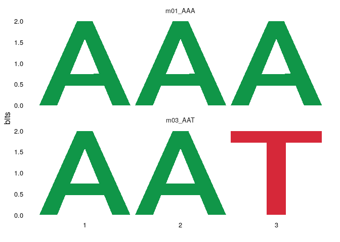

<!-- README.md is generated from README.Rmd. Please edit that file -->

# dremeR

<!-- badges: start -->

[](https://www.tidyverse.org/lifecycle/#experimental)
[](https://www.repostatus.org/#wip)
<!-- badges: end -->

An R interface to the [MEME Suite](http://meme-suite.org/) family of
tools.

## Installation

You can install the development version of dremeR from
[GitHub](https://github.com/) with:

``` r
# install.packages("remotes")
remotes::install_github("snystrom/dotargs")
remotes::install_github("snystrom/dremeR")
```

## Example

This is a basic example which shows you how to solve a common problem:

``` r
library(dremeR)
## basic example code
```

``` r
fa <- "inst/extdata/fasta_ex/fa1.fa"
dreme_out <- runDreme(fa, "shuffle", e = 39)
#> Registered S3 method overwritten by 'treeio':
#>   method     from
#>   root.phylo ape
```

dreme results are a `data.frame`. The `motifs` column contains a
`universalmotif` object with the PCM information for each *de-novo*
discovered motif. This is so that any filtering of the results object
also simply filter the available motifs.

``` r
dreme_out
#>   rank           id     alt      seq length nsites positive_hits negative_hits
#> 1    1      m01_AAA DREME-1      AAA      3      5             1             1
#> 2    2 m02_AATAATAA DREME-2 AATAATAA      8     10             1             0
#> 3    3      m03_AAT DREME-3      AAT      3     10             1             1
#>   pvalue evalue unerased_evalue positive_total negative_total pos_frac neg_frac
#> 1    1.0     39              39              1              1        1        1
#> 2    0.5      9              18              1              1        1        0
#> 3    1.0     12              12              1              1        1        1
#>                                                                 motifs
#> 1 <S4 class 'universalmotif' [package "universalmotif"] with 20 slots>
#> 2 <S4 class 'universalmotif' [package "universalmotif"] with 20 slots>
#> 3 <S4 class 'universalmotif' [package "universalmotif"] with 20 slots>
```

``` r
library(universalmotif)

view_motifs(dreme_out$motifs)
```

 The
primary advantage of using the `data.frame` output allows simple
integration with base subsetting, piping, and the `tidyverse`.

``` r
library(dplyr)
#> 
#> Attaching package: 'dplyr'
#> The following objects are masked from 'package:stats':
#> 
#>     filter, lag
#> The following objects are masked from 'package:base':
#> 
#>     intersect, setdiff, setequal, union

dreme_out %>% 
  filter(length == 3) %>% 
  {universalmotif::view_motifs(.$motifs)}
```



`universalmotif` manipulations can easily be executed on data.frame
columns. For example:

``` r
dreme_out$motifs %>% 
  merge_motifs() %>% 
  view_motifs()
```


