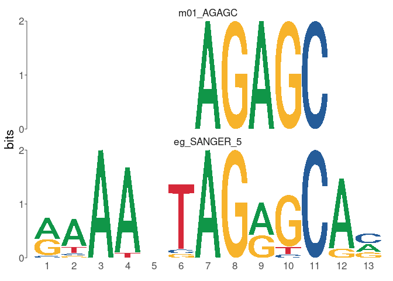

<!-- README.md is generated from README.Rmd. Please edit that file -->

# memes

<!-- badges: start -->

[](https://www.tidyverse.org/lifecycle/#experimental)
[](https://www.repostatus.org/#active)
[](https://codecov.io/gh/snystrom/dremeR?branch=master)
[](https://github.com/snystrom/dremeR/actions)
<!-- badges: end -->

An R interface to the [MEME Suite](http://meme-suite.org/) family of
tools, which provides several utilities for performing motif analysis on
DNA, RNA, and protein sequences. memes works by detecting a local
install of the MEME suite, running the commands, then importing the
results directly into R.

## Installation

### Development Version

You can install the development version of memes from
[GitHub](https://github.com/snystrom/memes) with:

``` r
if (!requireNamespace("remotes", quietly=TRUE))
  install.packages("remotes")
remotes::install_github("snystrom/memes")
```

### Docker Container

``` shell
# Get development version from dockerhub
docker pull snystrom/memes_docker:devel
# the -v flag is used to mount an analysis directory, 
# it can be excluded for demo purposes
docker run -e PASSWORD=<password> -p 8787:8787 -v <path>/<to>/<project>:/mnt/<project> snystrom/memes_docker:devel
```

## Detecting the MEME Suite

memes relies on a local install of the [MEME
Suite](http://meme-suite.org/). For installation instructions for the
MEME suite, see the [MEME Suite Installation
Guide](http://meme-suite.org/doc/install.html?man_type=web).

memes needs to know the location of the `meme/bin/` directory on your
local machine. You can tell memes the location of your MEME suite
install in 4 ways. memes will always prefer the more specific definition
if it is a valid path. Here they are ranked from most- to
least-specific:

1.  Manually passing the install path to the `meme_path` argument of all
    memes functions
2.  Setting the path using `options(meme_bin = "/path/to/meme/bin/")`
    inside your R script
3.  Setting `MEME_BIN=/path/to/meme/bin/` in your `.Renviron` file
4.  memes will try the default MEME install location `~/meme/bin/`

If memes fails to detect your install at the specified location, it will
fall back to the next option.

To verify memes can detect your MEME install, use `check_meme_install()`
which uses the search herirarchy above to find a valid MEME install. It
will report whether any tools are missing, and print the path to MEME
that it sees. This can be useful for troubleshooting issues with your
install.

``` r
library(memes)

# Verify that memes detects your meme install
# (returns all green checks if so)
# (I have MEME installed to the default location)
check_meme_install()
#> checking main install
#> ✓ /opt/meme/bin
#> checking util installs
#> ✓ /opt/meme/bin/dreme
#> ✓ /opt/meme/bin/ame
#> ✓ /opt/meme/bin/fimo
#> ✓ /opt/meme/bin/tomtom
#> ✓ /opt/meme/bin/meme
```

``` r
# You can manually input a path to meme_path
# If no meme/bin is detected, will return a red X
check_meme_install(meme_path = 'bad/path')
#> checking main install
#> x bad/path
```

## The Core Tools

| Function Name |              Use               | Sequence Input | Motif Input | Output                                                  |
| :-----------: | :----------------------------: | :------------: | :---------: | :------------------------------------------------------ |
| `runDreme()`  | Motif Discovery (short motifs) |      Yes       |     No      | data.frame w/ `motifs` column                           |
|  `runAme()`   |        Motif Enrichment        |      Yes       |     Yes     | data.frame (optional: `sequences` column)               |
|  `runFimo()`  |         Motif Scanning         |      Yes       |     Yes     | GRanges of motif positions                              |
| `runTomTom()` |        Motif Comparison        |       No       |     Yes     | data.frame w/ `best_match_motif` and `tomtom` columns\* |
|  `runMeme()`  | Motif Discovery (long motifs)  |      Yes       |     No      | data.frame w/ `motifs` column                           |

\* **Note:** if `runTomTom()` is run using the results of `runDreme()`,
the results will be joined with the `runDreme()` results as extra
columns. This allows easy comparison of *de-novo* discovered motifs with
their matches.

**Sequence Inputs** can be any of:

1.  Path to a .fasta formatted file
2.  `Biostrings::XStringSet` (can be generated from GRanges using
    `get_sequence()` helper function)
3.  A named list of `Biostrings::XStringSet` objects (generated by
    `get_sequence()`)

**Motif Inputs** can be any of:

1.  A path to a .meme formatted file of motifs to scan against
2.  A `universalmotif` object, or list of `universalmotif` objects
3.  A `runDreme()` results object (this allows the results of
    `runDreme()` to pass directly to `runTomTom()`)
4.  A combination of all of the above passed as a `list()`
    (e.g. `list("path/to/database.meme", "dreme_results" = dreme_res)`)

**Output Types**:

`runDreme()`, and `runTomTom()` return data.frames with special columns.
The `motif` column contains `universalmotif` objects, with 1 entry per
row. The remaining columns describe the properties of each returned
motif. The following column names are special in that their values are
used when running `update_motifs` to alter the properties of the motifs
stored in the `motif` column. Be careful about changing these values.

  - name
  - altname
  - family
  - organism
  - strand
  - nsites
  - bkgsites
  - pval
  - qval
  - eval

memes is built around the [universalmotif
package](https://www.bioconductor.org/packages/release/bioc/html/universalmotif.html)
which provides a framework for manipulating motifs in R. The `motif`
columns from `runDreme()` and `runTomTom()` can be used natively with
all `universalmotif` functions (eg
`universalmotif::view_motifs(dreme_results$motif)`).

`runTomTom()` returns a special column: `tomtom` which is a `data.frame`
of all match data for each input motif. This can be expanded out using
`tidyr::unnest(tomtom_results, "tomtom")`.

## Quick Examples

### Motif Discovery with DREME

``` r
suppressPackageStartupMessages(library(magrittr))
suppressPackageStartupMessages(library(GenomicRanges))

# Example transcription factor peaks as GRanges
data("example_peaks", package = "memes")

# Genome object
dm.genome <- BSgenome.Dmelanogaster.UCSC.dm6::BSgenome.Dmelanogaster.UCSC.dm6
```

The `get_sequence` function takes a `GRanges` or `GRangesList` as input
and returns the sequences as a `BioStrings::XStringSet`, or list of
`XStringSet` objects, respectively. `get_sequence` will name each fasta
entry by the genomic coordinates each sequence is from.

``` r
# Generate sequences from 200bp about the center of my peaks of interest
sequences <- example_peaks %>% 
  resize(200, "center") %>% 
  get_sequence(dm.genome)
```

`runDreme()` accepts XStringSet or a path to a fasta file as input. You
can use other sequences or shuffled input sequences as the control
dataset.

``` r
# runDreme accepts all arguments that the commandline version of dreme accepts
# here I set e = 50 to detect motifs in the limited example peak list
# In a real analysis, e should typically be < 1
dreme_results <- runDreme(sequences, control = "shuffle", e = 50)
```

memes is built around the
[universalmotif](https://www.bioconductor.org/packages/release/bioc/html/universalmotif.html)
package. The `motif` column of the runDreme results object contains
`universalmotif` objects which can be used natively in all
`universalmotif` functions.

``` r
library(universalmotif)
view_motifs(dreme_results$motif)
```

<!-- -->

### Matching motifs using TOMTOM

Discovered motifs can be matched to known TF motifs using `runTomTom()`,
which can accept as input a path to a .meme formatted file, a
`universalmotif` list, or the results of `runDreme()`.

TomTom uses a database of known motifs which can be passed to the
`database` parameter as a path to a .meme format file, or a
`universalmotif` object.

Optionally, you can set the environment variable `MEME_DB` in
`.Renviron`, or the `meme_db` value in `options` to a valid .meme format
file and memes will use that file as the database. memes will always
prefer user input to the function call.

``` r
options(meme_db = system.file("extdata/flyFactorSurvey_cleaned.meme", package = "memes"))
m <- create_motif("CMATTACN", altname = "testMotif")
tomtom_results <- runTomTom(m)
```

``` r
tomtom_results
#>    name   altname family organism consensus alphabet strand icscore nsites
#> 1 motif testMotif   <NA>     <NA>  CMATTACN      DNA     +-      13     NA
#>   bkgsites pval qval eval best_match_name best_match_altname
#> 1       NA   NA   NA   NA      prd_FlyReg                prd
#>                                                       best_match_motif
#> 1 <S4 class 'universalmotif' [package "universalmotif"] with 20 slots>
#>              best_db_name best_match_offset best_match_pvalue best_match_evalue
#> 1 flyFactorSurvey_cleaned                 0          7.12e-06           0.00407
#>   best_match_qvalue best_match_strand
#> 1           0.00709                 +
#>                                                                  motif
#> 1 <S4 class 'universalmotif' [package "universalmotif"] with 20 slots>
#>                                                                                                                                                                                                                                                                                                                                                                                                                                                                                                                                                                                                                                                                                                                                                                                                                                                                                                                                                                                                                                                                                                                                                                                                                                                                                                                                                                                                                                                                                                                                                                                                                                                                                                                                                                                                                                                                                                                                                                                                                                                                                                                                                                                                                                                                                                                                                                                                                                                                                                                                                                                                                                                                                                                                                                                                                                                                                                                                                                                                                                                                                                                                                                                                                                                                                                                                                                                                                                                                                                                                                                                                                                                                                                                                                                                                                                                                                                                                                                                                                                                                                                                                                                                                                                                                                                                                                                                                                                                                                                                                                                                                                                                                                                                                                                                                                                                                                                                                                                                                                                                                                                                                                                                                                                                                                                                                                                                                                                                                                                                                                                                                                                                                                                                                                                                                                                                                                                                                                                                                                                                                                                                                                                                                                                                                                                                                                                                                                                                                                                                                                                                                                                                                                                                                                                                                                                                                                                                                                                                                                                                                                                                                                                                                                                                                                                                                                                                                                                                                                                                                                                                                                                                                                                                                                                                                                                                                                                                                                                                                                                                                                                                                                                                                                                                                                                                                                                                                                                                                                                                                                                                                                                                                                                                                                                                                                                                                                                                                                                                                                                                                                                                                                                                                                                                                                                                                                                                                                                                                                                                                                                                                                                          tomtom
#> 1 prd_FlyReg, Ubx_FlyReg, Dr_SOLEXA, ftz_FlyReg, Hmx_SOLEXA, Dll_SOLEXA, BH1_SOLEXA, Exex_SOLEXA, Tup_Cell, Tup_SOLEXA, ovo_FlyReg, NK7.1_SOLEXA, Hmx_Cell, en_FlyReg, Bsh_Cell, tup_SOLEXA_10, CG34031_Cell, Exex_Cell, Dr_Cell, Unc4_Cell, CG11085_Cell, CG13424_SOLEXA, Abd-A_FlyReg, NK7.1_Cell, Dll_Cell, Dfd_FlyReg, CG13424_Cell, pho_FlyReg, CG32532_Cell, Odsh_Cell, Ftz_SOLEXA, Scr_SOLEXA, C15_Cell, CG15696_Cell, CG34031_SOLEXA, CG15696_SOLEXA, BH2_Cell, Bsh_SOLEXA, En_SOLEXA, Slou_SOLEXA, Slou_Cell, ap_FlyReg, Antp_SOLEXA, C15_SOLEXA, Zen2_SOLEXA, AbdA_SOLEXA, E5_SOLEXA, Awh_SOLEXA, Ems_SOLEXA, Lab_SOLEXA, Repo_SOLEXA, Unpg_SOLEXA, Ubx_Cell, Unpg_Cell, Ap_SOLEXA, Btn_SOLEXA, Pb_SOLEXA, Dfd_SOLEXA, Odsh_SOLEXA, Unc4_SOLEXA, BH2_SOLEXA, En_Cell, Hgtx_Cell, Ubx_SOLEXA, CG32532_SOLEXA, CG4136_SOLEXA, prd, Ubx, Dr, ftz, Hmx, Dll, B-H1, exex, tup, tup, ovo, NK7.1, Hmx, en, bsh, tup, CG34031, exex, Dr, unc-4, CG11085, lms, abd-A, NK7.1, Dll, Dfd, lms, pho, CG32532, OdsH, ftz, Scr, C15, CG15696, CG34031, CG15696, B-H2, bsh, en, slou, slou, ap, Antp, C15, zen2, abd-A, E5, Awh, ems, lab, repo, unpg, Ubx, unpg, ap, btn, pb, Dfd, OdsH, unc-4, B-H2, en, HGTX, Ubx, CG32532, CG4136, <S4 class 'universalmotif' [package "universalmotif"] with 20 slots>, <S4 class 'universalmotif' [package "universalmotif"] with 20 slots>, <S4 class 'universalmotif' [package "universalmotif"] with 20 slots>, <S4 class 'universalmotif' [package "universalmotif"] with 20 slots>, <S4 class 'universalmotif' [package "universalmotif"] with 20 slots>, <S4 class 'universalmotif' [package "universalmotif"] with 20 slots>, <S4 class 'universalmotif' [package "universalmotif"] with 20 slots>, <S4 class 'universalmotif' [package "universalmotif"] with 20 slots>, <S4 class 'universalmotif' [package "universalmotif"] with 20 slots>, <S4 class 'universalmotif' [package "universalmotif"] with 20 slots>, <S4 class 'universalmotif' [package "universalmotif"] with 20 slots>, <S4 class 'universalmotif' [package "universalmotif"] with 20 slots>, <S4 class 'universalmotif' [package "universalmotif"] with 20 slots>, <S4 class 'universalmotif' [package "universalmotif"] with 20 slots>, <S4 class 'universalmotif' [package "universalmotif"] with 20 slots>, <S4 class 'universalmotif' [package "universalmotif"] with 20 slots>, <S4 class 'universalmotif' [package "universalmotif"] with 20 slots>, <S4 class 'universalmotif' [package "universalmotif"] with 20 slots>, <S4 class 'universalmotif' [package "universalmotif"] with 20 slots>, <S4 class 'universalmotif' [package "universalmotif"] with 20 slots>, <S4 class 'universalmotif' [package "universalmotif"] with 20 slots>, <S4 class 'universalmotif' [package "universalmotif"] with 20 slots>, <S4 class 'universalmotif' [package "universalmotif"] with 20 slots>, <S4 class 'universalmotif' [package "universalmotif"] with 20 slots>, <S4 class 'universalmotif' [package "universalmotif"] with 20 slots>, <S4 class 'universalmotif' [package "universalmotif"] with 20 slots>, <S4 class 'universalmotif' [package "universalmotif"] with 20 slots>, <S4 class 'universalmotif' [package "universalmotif"] with 20 slots>, <S4 class 'universalmotif' [package "universalmotif"] with 20 slots>, <S4 class 'universalmotif' [package "universalmotif"] with 20 slots>, <S4 class 'universalmotif' [package "universalmotif"] with 20 slots>, <S4 class 'universalmotif' [package "universalmotif"] with 20 slots>, <S4 class 'universalmotif' [package "universalmotif"] with 20 slots>, <S4 class 'universalmotif' [package "universalmotif"] with 20 slots>, <S4 class 'universalmotif' [package "universalmotif"] with 20 slots>, <S4 class 'universalmotif' [package "universalmotif"] with 20 slots>, <S4 class 'universalmotif' [package "universalmotif"] with 20 slots>, <S4 class 'universalmotif' [package "universalmotif"] with 20 slots>, <S4 class 'universalmotif' [package "universalmotif"] with 20 slots>, <S4 class 'universalmotif' [package "universalmotif"] with 20 slots>, <S4 class 'universalmotif' [package "universalmotif"] with 20 slots>, <S4 class 'universalmotif' [package "universalmotif"] with 20 slots>, <S4 class 'universalmotif' [package "universalmotif"] with 20 slots>, <S4 class 'universalmotif' [package "universalmotif"] with 20 slots>, <S4 class 'universalmotif' [package "universalmotif"] with 20 slots>, <S4 class 'universalmotif' [package "universalmotif"] with 20 slots>, <S4 class 'universalmotif' [package "universalmotif"] with 20 slots>, <S4 class 'universalmotif' [package "universalmotif"] with 20 slots>, <S4 class 'universalmotif' [package "universalmotif"] with 20 slots>, <S4 class 'universalmotif' [package "universalmotif"] with 20 slots>, <S4 class 'universalmotif' [package "universalmotif"] with 20 slots>, <S4 class 'universalmotif' [package "universalmotif"] with 20 slots>, <S4 class 'universalmotif' [package "universalmotif"] with 20 slots>, <S4 class 'universalmotif' [package "universalmotif"] with 20 slots>, <S4 class 'universalmotif' [package "universalmotif"] with 20 slots>, <S4 class 'universalmotif' [package "universalmotif"] with 20 slots>, <S4 class 'universalmotif' [package "universalmotif"] with 20 slots>, <S4 class 'universalmotif' [package "universalmotif"] with 20 slots>, <S4 class 'universalmotif' [package "universalmotif"] with 20 slots>, <S4 class 'universalmotif' [package "universalmotif"] with 20 slots>, <S4 class 'universalmotif' [package "universalmotif"] with 20 slots>, <S4 class 'universalmotif' [package "universalmotif"] with 20 slots>, <S4 class 'universalmotif' [package "universalmotif"] with 20 slots>, <S4 class 'universalmotif' [package "universalmotif"] with 20 slots>, <S4 class 'universalmotif' [package "universalmotif"] with 20 slots>, <S4 class 'universalmotif' [package "universalmotif"] with 20 slots>, flyFactorSurvey_cleaned, flyFactorSurvey_cleaned, flyFactorSurvey_cleaned, flyFactorSurvey_cleaned, flyFactorSurvey_cleaned, flyFactorSurvey_cleaned, flyFactorSurvey_cleaned, flyFactorSurvey_cleaned, flyFactorSurvey_cleaned, flyFactorSurvey_cleaned, flyFactorSurvey_cleaned, flyFactorSurvey_cleaned, flyFactorSurvey_cleaned, flyFactorSurvey_cleaned, flyFactorSurvey_cleaned, flyFactorSurvey_cleaned, flyFactorSurvey_cleaned, flyFactorSurvey_cleaned, flyFactorSurvey_cleaned, flyFactorSurvey_cleaned, flyFactorSurvey_cleaned, flyFactorSurvey_cleaned, flyFactorSurvey_cleaned, flyFactorSurvey_cleaned, flyFactorSurvey_cleaned, flyFactorSurvey_cleaned, flyFactorSurvey_cleaned, flyFactorSurvey_cleaned, flyFactorSurvey_cleaned, flyFactorSurvey_cleaned, flyFactorSurvey_cleaned, flyFactorSurvey_cleaned, flyFactorSurvey_cleaned, flyFactorSurvey_cleaned, flyFactorSurvey_cleaned, flyFactorSurvey_cleaned, flyFactorSurvey_cleaned, flyFactorSurvey_cleaned, flyFactorSurvey_cleaned, flyFactorSurvey_cleaned, flyFactorSurvey_cleaned, flyFactorSurvey_cleaned, flyFactorSurvey_cleaned, flyFactorSurvey_cleaned, flyFactorSurvey_cleaned, flyFactorSurvey_cleaned, flyFactorSurvey_cleaned, flyFactorSurvey_cleaned, flyFactorSurvey_cleaned, flyFactorSurvey_cleaned, flyFactorSurvey_cleaned, flyFactorSurvey_cleaned, flyFactorSurvey_cleaned, flyFactorSurvey_cleaned, flyFactorSurvey_cleaned, flyFactorSurvey_cleaned, flyFactorSurvey_cleaned, flyFactorSurvey_cleaned, flyFactorSurvey_cleaned, flyFactorSurvey_cleaned, flyFactorSurvey_cleaned, flyFactorSurvey_cleaned, flyFactorSurvey_cleaned, flyFactorSurvey_cleaned, flyFactorSurvey_cleaned, flyFactorSurvey_cleaned, 0, 0, 0, 2, 0, 0, 0, 0, 0, 0, 0, 0, 0, 0, 1, 1, 0, 0, 3, 0, 1, 0, 1, 0, 0, 1, 0, 4, 0, 0, 0, 0, 0, 0, 0, 0, 1, 0, 0, 0, 0, 0, 0, 0, 0, 0, 0, 0, 0, 0, 0, 0, 0, 0, 0, 0, 0, 0, 0, 0, 0, 0, 0, 0, 0, 0, 7.12e-06, 4.12e-05, 0.00115, 0.00116, 0.00118, 0.00128, 0.00142, 0.00142, 0.00167, 0.00175, 0.00201, 0.00291, 0.00359, 0.00359, 0.00403, 0.00403, 0.00505, 0.00508, 0.00516, 0.00559, 0.00579, 0.0059, 0.00673, 0.00673, 0.00724, 0.00733, 0.00795, 0.00842, 0.00846, 0.00846, 0.00912, 0.00912, 0.00925, 0.00925, 0.00925, 0.00994, 0.0103, 0.0105, 0.0105, 0.0105, 0.0106, 0.0109, 0.0114, 0.0121, 0.0128, 0.013, 0.0136, 0.0145, 0.0145, 0.0145, 0.0145, 0.0145, 0.015, 0.015, 0.0154, 0.0154, 0.0154, 0.016, 0.016, 0.016, 0.017, 0.017, 0.017, 0.017, 0.0175, 0.0175, 0.00407, 0.0235, 0.656, 0.665, 0.674, 0.731, 0.808, 0.808, 0.951, 0.999, 1.15, 1.66, 2.05, 2.05, 2.3, 2.3, 2.88, 2.9, 2.95, 3.19, 3.31, 3.37, 3.84, 3.84, 4.14, 4.19, 4.54, 4.81, 4.83, 4.83, 5.21, 5.21, 5.28, 5.28, 5.28, 5.68, 5.91, 6, 6, 6, 6.08, 6.2, 6.5, 6.93, 7.3, 7.44, 7.77, 8.26, 8.26, 8.26, 8.26, 8.26, 8.54, 8.54, 8.79, 8.79, 8.79, 9.12, 9.12, 9.12, 9.73, 9.73, 9.73, 9.73, 9.98, 9.98, 0.00709, 0.0205, 0.174, 0.174, 0.174, 0.174, 0.174, 0.174, 0.174, 0.174, 0.182, 0.242, 0.251, 0.251, 0.251, 0.251, 0.251, 0.251, 0.251, 0.251, 0.251, 0.251, 0.251, 0.251, 0.251, 0.251, 0.251, 0.251, 0.251, 0.251, 0.251, 0.251, 0.251, 0.251, 0.251, 0.251, 0.251, 0.251, 0.251, 0.251, 0.251, 0.251, 0.258, 0.258, 0.258, 0.258, 0.258, 0.258, 0.258, 0.258, 0.258, 0.258, 0.258, 0.258, 0.258, 0.258, 0.258, 0.258, 0.258, 0.258, 0.258, 0.258, 0.258, 0.258, 0.258, 0.258, +, +, -, +, -, -, -, -, -, -, +, -, -, -, -, -, -, -, +, -, -, -, +, -, +, -, -, -, -, -, -, -, -, -, -, -, -, -, -, -, -, +, -, -, -, -, -, -, -, -, -, -, -, -, -, -, -, -, -, -, -, -, -, -, -, -
```

### Using runDreme results as TOMTOM input

`runTomTom()` will add its results as columns to a `runDreme()` results
data.frame.

``` r
full_results <- dreme_results %>% 
  runTomTom()
```

### Motif Enrichment using AME

AME is used to test for enrichment of known motifs in target sequences.
`runAme()` will use the `MEME_DB` entry in `.Renviron` or
`options(meme_db = "path/to/database.meme")` as the motif database.
Alternately, it will accept all valid inputs as `runTomTom()`.

``` r
# here I set e = 30 to detect motifs in the limited example sequences
# In a real analysis, e should typically be < 1
ame_results <- runAme(sequences, control = "shuffle", evalue_report_threshold = 30)
ame_results
#> # A tibble: 2 x 17
#>    rank motif_db motif_id motif_alt_id consensus  pvalue adj.pvalue evalue tests
#>   <int> <chr>    <chr>    <chr>        <chr>       <dbl>      <dbl>  <dbl> <int>
#> 1     1 /usr/lo… Eip93F_… Eip93F       ACWSCCRA… 5.14e-4     0.0339   19.3    67
#> 2     2 /usr/lo… Cf2-PB_… Cf2          CSSHNKDT… 1.57e-3     0.0415   23.7    27
#> # … with 8 more variables: fasta_max <dbl>, pos <int>, neg <int>,
#> #   pwm_min <dbl>, tp <int>, tp_percent <dbl>, fp <int>, fp_percent <dbl>
```

## Visualizing Results

`view_tomtom_hits` allows comparing the input motifs to the top hits
from TomTom. Manual inspection of these matches is important, as
sometimes the top match is not always the correct assignment. Altering
`top_n` allows you to show additional matches in descending order of
their rank.

``` r
full_results %>% 
  view_tomtom_hits(top_n = 1) %>% 
  # Here I use the cowplot library simply to combine each plot into a 4-panel grid
  cowplot::plot_grid(plotlist = .)
```

<!-- -->

It can be useful to view the results from `runAme()` as a heatmap.
`ame_plot_heatmap()` can create complex visualizations for analysis of
enrichment between different region types (see vignettes for details).
Here is a simple example heatmap.

``` r
ame_results %>% 
  ame_plot_heatmap()
```

<!-- -->

## Importing Data from previous runs

memes also supports importing results generated using the MEME suite
outside of R (for example, running jobs on
[meme-suite.org](meme-suite.org), or running on the commandline).

| MEME Tool |    Function Name    | File Type  |
| :-------: | :-----------------: | :--------: |
|   Dreme   | `importDremeXML()`  | dreme.xml  |
|  TomTom   | `importTomTomXML()` | tomtom.xml |
|    AME    |    `importAme()`    | ame.tsv\*  |
|   FIMO    |   `importFimo()`    |  fimo.tsv  |
|   Meme    |   `importMeme()`    |  meme.txt  |

\* `importAME()` can also use the “sequences.tsv” output when AME used
`method = "fisher"`, this is optional.

# FAQs

### How do I use memes/MEME on Windows?

The MEME Suite does not currently support Windows, although it can be
installed under [Cygwin](https://www.cygwin.com/) or the [Windows Linux
Subsytem](https://docs.microsoft.com/en-us/windows/wsl/install-win10)
(WSL). Please note that if MEME is installed on Cygwin or WSL, you must
also run R inside Cygwin or WSL to use memes.

An alternative solution is to use
[Docker](https://www.docker.com/get-started) to run a virtual
environment with the MEME Suite installed. We provide a [memes docker
container](https://github.com/snystrom/memes_docker)  
that ships with the MEME Suite, R studio, and all `memes` dependencies
pre-installed.

# Citation

memes is a wrapper for a select few tools from the MEME Suite, which
were developed by another group. In addition to citing memes, please
cite the MEME Suite tools corresponding to the tools you use.

If you use `runDreme()` in your analysis, please cite:

Timothy L. Bailey, “DREME: Motif discovery in transcription factor
ChIP-seq data”, Bioinformatics, 27(12):1653-1659, 2011. [full
text](https://academic.oup.com/bioinformatics/article/27/12/1653/257754)

If you use `runTomTom()` in your analysis, please cite:

Shobhit Gupta, JA Stamatoyannopolous, Timothy Bailey and William
Stafford Noble, “Quantifying similarity between motifs”, Genome Biology,
8(2):R24, 2007. [full text](http://genomebiology.com/2007/8/2/R24)

If you use `runAme()` in your analysis, please cite:

Robert McLeay and Timothy L. Bailey, “Motif Enrichment Analysis: A
unified framework and method evaluation”, BMC Bioinformatics, 11:165,
2010, <doi:10.1186/1471-2105-11-165>. [full
text](http://www.biomedcentral.com/1471-2105/11/165)

If you use `runFimo()` in your analysis, please cite:

Charles E. Grant, Timothy L. Bailey, and William Stafford Noble, “FIMO:
Scanning for occurrences of a given motif”, Bioinformatics,
27(7):1017-1018, 2011. [full
text](http://bioinformatics.oxfordjournals.org/content/early/2011/02/16/bioinformatics.btr064.full)

## Licensing Restrictions

The MEME Suite is free for non-profit use, but for-profit users should
purchase a license. See the [MEME Suite Copyright
Page](http://meme-suite.org/doc/copyright.html) for details.
