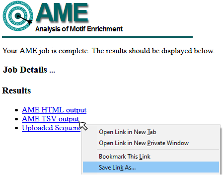

```{r, include=FALSE}
NOT_CRAN <- identical(tolower(Sys.getenv("NOT_CRAN")), "true")

eval_vignette <- NOT_CRAN & dremeR::meme_is_installed()

knitr::opts_chunk$set(
  collapse = TRUE,
  comment = "#>",
  purl = eval_vignette,
  eval = eval_vignette
)
```

```{r setup}
library(dremeR)
suppressPackageStartupMessages(library(GenomicRanges))
library(magrittr)
```

## Sequence Input
AME requires a series of input sequences to scan for motif enrichment.
`runAme()` accepts sequence input in the following formats:

 - a `Biostrings::XStringSet` object
 - a named list of `Biostrings::XStringSet` objects
 - a path to a .fasta file
 
**NOTE** `XStringSet` inputs can be easily generated for DNA sequences from a
GRanges object using the `get_sequence()` function

```{r}
data("example_peaks", package = "dremeR")

dm.genome <- BSgenome.Dmelanogaster.UCSC.dm3::BSgenome.Dmelanogaster.UCSC.dm3

sequence <- example_peaks %>% 
  get_sequence(dm.genome)
```

## Database Input
AME scans input sequences against a database of known motifs and tests for
enrichment of each motif in the database. `runAme()` can accept a database in
the following formats:

 - a list of universalmotif objects
 - a single universalmotif object
 - the results object from `runDreme`
 - a path to a .meme format file

### Setting a default database 

dremeR can be configured to use a default .meme format file as the query
database, which it will use if the user does not provide a value to `database`
when calling `runAme()`. The following locations will be searched in order.

1. The `meme_db` option, defined using `options(meme_db = "path/to/database.meme")`
 - The `meme_db` option can also be set to an R object, like a universalmotif list.
2. The `MEME_DB` environment variable defined in `.Renviron`
 - The `MEME_DB` variable will only accept a path to a .meme file

**NOTE:** if an invalid location is found at one option, `runAme()` will fall
back to the next location if valid (eg if the `meme_db` option is set to an
invalid file, but the `MEME_DB` environment variable is a valid file, the
`MEME_DB` path will be used.

```{r}
options(meme_db = system.file("extdata/db/fly_factor_survey_id.meme", package = "dremeR"))
```

## Running AME

`runAme()` supports running AME using three modes:

| AME Mode          | Description                | Command                                         |
|:-----------------:|:--------------------------:|:------------------------------------------------|
| Vs Shuffled       | Input vs Shuffled Sequence | `runAme(input = sequence, control = "shuffle")` |
| Discriminative    | Input vs Control Sequence  | `runAme(input = sequence, control = control)`   |
| Partitioning      | Rank Input by fasta score  | `runAme(input = sequence, control = NA)`        |

```{r, eval=F}
ame_vs_shuffle <- runAme(sequence)
```

```{r, eval=F}
ame_vs_control <- runAme(sequence[1:5], sequence[6:10])
```


To run AME using partitioning mode, the fasta header must contain a score value
for each entry in the form: ">entry_name score". The `get_sequences()` `score`
argument allows users to set the score value to a column value from input
regions.

```{r}
sequence_scored <- example_peaks %>% 
  plyranges::mutate(score = seq_along(.)) %>% 
  get_sequence(dm.genome, score = "score")

names(sequence_scored)[1]
```
```{r, eval=F}
ame_partition <- runAme(sequence_scored, control = NA)
```

### Running AME on multiple groups

If using a list input to `runAme()`, it will dispatch multiple AME runs for each
object in the list.

```{r}
data("example_chip_summits", package = "dremeR")

seq_by_behavior <- example_chip_summits %>% 
  plyranges::mutate(width = 100) %>% 
  split(mcols(.)$e93_sensitive_behavior) %>% 
  get_sequence(dm.genome)
```
```{r, eval=F}
ame_by_behavior <- runAme(seq_by_behavior)
```

#### Discriminative analysis using list input

If the input to `runAme()` is a named list of `XStringSet` objects, `control`
can be set to one or more values from `names(input)` to use those regions as
background. It will skip running those regions as the input. The following code
will result in these comparisons:

1. Increasing vs Static
2. Decreasing vs Static
```{r}
ame_by_behavior_vs_static <- runAme(seq_by_behavior, control = "Static")
```

If multiple names are used in the `control` section, they will be combined
together to make a single control set which will be used for all comparisons.
Here, we use "Static" and "Decreasing" sites as the control, which will result
in only running 1 comparison: Increasing vs Static+Decreasing.
```{r, eval=F}
runAme(seq_by_behavior, control = c("Static", "Decreasing"))
```
```{r, echo=F}
data("example_ame", package = "dremeR")
ame_by_behavior_vs_static <- example_ame
```

## Output Format

AME will return different output formats depending on the `method` used. For
detailed information about these values see the [AME Output description
webpage](http://meme-suite.org/doc/ame-output-format.html). As a general rule of
thumb, `runAme()` will return the same column names described in the webpage,
except dashes are removed and all column names are lowercase.

```{r}
ame_by_behavior_vs_static$Decreasing %>% 
  names
```

If `runAme()` is run with `method = "fisher"`, the sequences output can be added
to the results by setting `sequences = TRUE`. This will be added as a list
column named `sequences` that can be unnested using `tidyr::unnest()`.

## Visualizing Results as Heatmap
 - move heatmap information here
 
```{r}
ame_by_behavior_vs_static %>% 
  # AME results in list format are easily combined using dplyr::bind_rows
  # .id will specify a column to hold the list object names
  dplyr::bind_rows(.id = "behavior") %>% 
  # setting group to a column name will split the results on the y-axis
  ame_plot_heatmap(group = behavior)
```

# NEW SECTION RE: HEATMAP complexity
moving this here because chip-seq example now integrates RNAseq filtering, so hits are more limited
```{r}
seq_by_binding <- example_chip_summits %>% 
  plyranges::mutate(width = 100) %>% 
  split(mcols(.)$peak_binding_description) %>% 
  get_sequence(dm.genome)
```

```{r, eval=F}
ame_by_binding <- seq_by_binding %>% 
  runAme
```
```{r, echo=F}
# Allows vignette to build on systems w/o functioning MEME suite
data("example_ame_large", package = "dremeR")
ame_by_binding <- example_ame_large
```

### Visualizing AME results 

The `ame_plot_heatmap()` function provides a quick way to visualize AME results.
It is built on top of `ggplot2`, so all `ggplot2` functions can be used to
further modify the plot.

By default, it uses the -log10(adjusted p-value) as the heat values. See the
documentation for additional notes on customization.
```{r, fig.height=3.5, fig.width=7}
library(ggplot2)

ame_by_binding$entopic %>% 
  dplyr::filter(rank %in% 1:10) %>% 
  ame_plot_heatmap(group_name = "Entopic Sites")  +
    ggtitle("Top 10 AME Hits in Entopic Sites")
```

To plot results from multiple runs together, they must first be joined into 1
data frame. The `ame_by_binding` object is a list whose names correspond to the
E93 binding category. The list can be combined into a data.frame using
`dplyr::bind_rows`. Setting `.id = "binding_type` creates a new column
`binding_type` that contains the names from the `ame_by_binding` list. In this
way, the `ame_res` data.frame contains all AME results for each run, which can
be distinguished by the `binding_type` column.
```{r}
ame_res <- ame_by_binding %>% 
  dplyr::bind_rows(.id = "binding_type")
  
```

It is possible to aggregate results from multiple runs into a heatmap by setting
the `group` parameter in `ame_plot_heatmap()`.

This is too many hits to properly view in this vignette, but you can see that the heatmap
will plot motifs by their overlap across groups, where unique motifs are on the
left, and shared motifs are on the right.
```{r, fig.height=5,fig.width=15}
ame_res %>% 
  ame_plot_heatmap(group = binding_type)
```

## Issues with Heatmap Visualization
When visualizing data as a heatmap, 
Finally, because the data for each binding type are generated from different AME
runs, it is not the best idea to compare p-values across experiments (ie between
heatmap rows), because the dynamic range of p-values will vary between groups. Here you
can see that, for example, the orphan sites will have a very different scale of
-log10(adjusted pvalues) than ectopic and entopic sites. In other words, because
the dynamic range of values are different between experiments, placing them on
the default scale for comparison may not always be the most optimal visualization.

We can partially overcome this limitation by filling the heatmap with the
normalized rank value for each TF, which accounts for differences in total number of
discovered motifs between AME runs. Although it does not completely abrograte
differeces, the signal values for high-ranked motifs within groups will be more
comparable. However, **the normalized rank visualization eliminates all real values related to statistical significance!** 
Instead, this visualization represents the relative ranks of hits within an AME
run, which already pass a significance threshold set during `runAME()`. This
means that even if several motifs have similar or even identical p-values, their
heatmap representation will be a different color value based on their ranked
order in the results list. This tends to only be useful when there are a large
number of hits (>=100). Both visualizations can be useful and reveal different
properties of the data to the user. **If in doubt**, prefer the
`-log10(adj.pvalue)` representation.

Below is a comparison of the distribution of values when using
`-log10(adj.pvalue)` (A) vs normalized ranks (B). Because orphan sites tend to
have smaller p-values overall, the heatmap scale will be skewed towards the high
values in the orphan data, making ectopic and entopic heat values lighter by
comparison.
```{r, fig.height=3, fig.width=7.5}
ame_res %>% 
  ame_compare_heatmap_methods(group = binding_type)
```

To use the normalized rank value, set `value = "normalize"` in `ame_plot_heatmap()`.

This plot reveals that the motifs which tend to be shared across all 3
categories tend to be higher ranks in the output than the motifs unique to the
different categories, which tend to come from lower ranks. This *suggests* that
although there are differences in motif content across the three categories,
they may be largely similar in motif makeup. We will investigate this question
in more detail in the "Denovo motif similarity" section.
```{r, fig.height=3, fig.width=25}
(normalize_heatmap <- ame_res %>% 
  dplyr::group_by(binding_type, motif_alt_id) %>% 
  dplyr::filter(adj.pvalue == min(adj.pvalue)) %>% 
  ame_plot_heatmap(group = binding_type, id = motif_alt_id, value = "normalize") +
    ggtitle("value = \"normalize\""))
```

An additional third option exists to rescale the `-log10(adj.pvalue)` heatmap to
change the heatmap's maxiumum color value. This allows the user to maintain
values which represent significance, but rescale the data to capture the lower
end of the dynamic range. Using the cumulative distribution plot above, a
reasonable cutoff is anywhere between 7 & 10, which captures > 90% of the data
for ectopic and entopic sites. 

A comparison of all three methods can be seen below. 

```{r, fig.height=3, fig.width=25}
pval_heatmap <- ame_res %>% 
  dplyr::group_by(binding_type, motif_alt_id) %>% 
  dplyr::filter(adj.pvalue == min(adj.pvalue)) %>% 
  ame_plot_heatmap(group = binding_type, id = motif_alt_id) +
    ggtitle("value = -log10(adj.pvalue)")

scale_heatmap <- ame_res %>% 
  dplyr::group_by(binding_type, motif_alt_id) %>% 
  dplyr::filter(adj.pvalue == min(adj.pvalue)) %>% 
  ame_plot_heatmap(group = binding_type, id = motif_alt_id, scale_max = 7.5) +
    ggtitle("value = -log10(adj.pvalue) (scale capped at 7.5)")
```

Below is a comparison using the `-log10(adj.pvalue)` vs `normalize` methods for
plotting the heatmap. Note how the different plots highlight different data
properties. The `-log10(adj.pvalue)` plot shows overall significance of each
hit, while `normalize` method shows the relative rank of each hit within a
`binding_type`. Lowering the maximum scale value in C) does a better job than A)
at visualizing differences in significance along the ectopic and entopic rows at
the cost of decreasing the dynamic range of the orphan row. Selecting a
visualization for publication will depend heavily on context, but if in doubt,
prefer one which includes information of statistical significance as in A) or C).
```{r, fig.height=9, fig.width=25}
cowplot::plot_grid(pval_heatmap, 
                   normalize_heatmap, 
                   scale_heatmap, 
                   ncol = 1, labels = "AUTO")
```

## Importing Previous Data

`importAme()` can be used to import an `ame.tsv` file from a previous run
on the MEME server or on the commandline. Details for how to save data from the
AME webserver are below.

Optionally, if AME was run on the commandline with `--method fisher`, the user
can pass a path to the `sequences.tsv` file to the `sequences` argument of
`importAme()` to append the sequence information to the AME results.

### Saving data from AME Web Server
To download TSV data from the MEME Server, right-click the AME TSV output link
and "Save Target As" or "Save Link As" (see example image below), and save as
`<filename>.tsv`. This file can be read using `importAme()`. 



# Citation

dremeR is a wrapper for a select few tools from the MEME Suite, which were
developed by another group. In addition to citing dremeR, please cite the MEME
Suite tools corresponding to the tools you use.

If you use `runAme()` in your analysis, please cite:

Robert McLeay and Timothy L. Bailey, "Motif Enrichment Analysis: A unified framework and method evaluation", BMC Bioinformatics, 11:165, 2010, doi:10.1186/1471-2105-11-165. [full text](http://www.biomedcentral.com/1471-2105/11/165)

## Licensing Restrictions
The MEME Suite is free for non-profit use, but for-profit users should purchase a
license. See the [MEME Suite Copyright Page](http://meme-suite.org/doc/copyright.html) for details.
