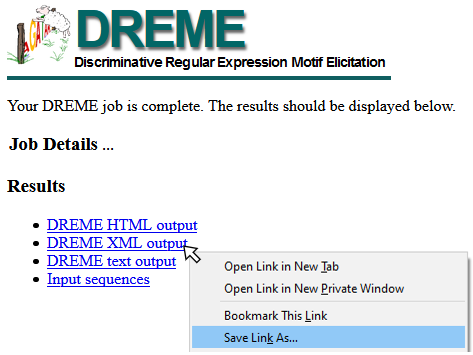

```{r, include=FALSE}
NOT_CRAN <- identical(tolower(Sys.getenv("NOT_CRAN")), "true")

eval_vignette <- NOT_CRAN & dremeR::meme_is_installed()

knitr::opts_chunk$set(
  collapse = TRUE,
  comment = "#>",
  purl = eval_vignette,
  eval = eval_vignette
)
```

```{r setup}
library(dremeR)
```

```{r}
# Verify that dremeR detects your meme install
# should return all green checks if so.
check_meme_install()
```

```{r}
fa <- system.file("extdata/fasta_ex/fa1.fa", package = "dremeR")
```

```{r}
# NOTE: setting e > 1 is usually not recomended. 
# the example fasta file only has 1 sequence in it
# to keep the file size low and let the example run quickly.
# I set evalue = 39 because dreme cannot detect high confidence motifs from only 1 sequence.
dreme_out <- runDreme(fa, "shuffle", evalue = 39, outdir = tempdir())
```

[DREME Commandline Documentation](http://meme-suite.org/doc/dreme.html)

### Aliased flags
| dremeR alias | DREME Flag | description                               |
|:------------:|:----------:|:------------------------------------------|
| nmotifs      | m*         | max number of motifs to discover          |
| sec          | t          | max number of seconds to run              |
| evalue       | e          | max E-value cutoff                        |
| seed         | s*         | random seed if using "shuffle" as control | 
| ngen         | g          | number of REs to generalize               |

\* flags marked with \* must be assigned using their alias
```{r, eval=F}
# equivalent to above
runDreme(fa, "shuffle", evalue = 39, outdir = tempdir())
runDreme(fa, "shuffle", e = 39, outdir = tempdir(), nmotifs = 2)
```

dreme results are a `data.frame`. The `motif` column contains a `universalmotif`
object with the PCM information for each *de-novo* discovered motif. This is so
that any filtering of the results object also simply filter the available
motifs. For more details about each column see the "Value" section of `?runDreme`.

```{r}
dreme_out
```

The `motif` column can be used as input to all `universalmotif` functions.
```{r}
library(universalmotif)

view_motifs(dreme_out$motif)
```

The primary advantage of using the `data.frame` output allows simple integration
with base subsetting, piping, and the `tidyverse`.
```{r}
library(dplyr)

dreme_out %>% 
  filter(length == 3) %>% 
  # after filtering with dplyr, only motifs with length 3 will be plotted
  {universalmotif::view_motifs(.$motif)}
```

`universalmotif` manipulations can easily be executed on the `motif` column as well. For example:
```{r, fig.height=1.5}
dreme_out$motif %>% 
  merge_motifs() %>% 
  view_motifs()
```

#### Updating motif information
Occasionally, it can be useful to update the metadata associated with a
dicovered motif (for example, to assign a new name to a denovo motif). dremeR
provides a few utilities to accomplish this.

`update_motifs()` will search for specific column names which describe
properties of the `motif` column and update the metadata in the `motif` column
to reflect those values. See `?update_motifs` for details.

`as_universalmotif()` will convert one of these special universalmotif
data.frames into a universalmotif list after updating the metadata to reflect
values as in `update_motifs()`.
```{r}
# update_motifs will update the values in the motif column
# to values in the data.frame
dreme_edit <- dreme_out %>% 
  dplyr::mutate(name = c("one", "two", "three")) %>% 
  update_motifs()

# as_universalmotif will first update motif information
# before returning only the motif column
edit_motifs <- dreme_out %>% 
  dplyr::mutate(name = c("one", "two", "three")) %>% 
  as_universalmotif()

# The following outputs are identical
# where edit_motifs is a list of motifs
# and dreme_edit is a data.frame with a motif list column
identical(edit_motifs$one, dreme_edit$motif$one)
```


### Notes about shuffled control sequences

Setting `control = "shuffle"` will use dreme's random number generator to
shuffle the input sequences. By default, dreme will use `1` as the random seed,
so repeat runs of the same shuffle command will produce the same output. To
change the random seed, pass `seed = [your random seed]` to `runDreme()`.
**NOTE:** beware system-specific differences. As of MEME v5, dreme will compile
using the default python installation on a system (either python2.7 or python3).
The random number generator changed between python2.7 and python3, so results
will not be reproducible between systems using python2.7 vs 3 
**even if setting the same random seed**.

One way to overcome this is to manually shuffle the sequences within R. This can
be done easily using `universalmotif::shuffle_sequences()`. Set `k = 2` to
preserve dinucleotide frequency (similar to dreme's built-in shuffle), and set
`rng.seed` to any number to create a reproducible shuffle. The output of this
function can be used directly as the control sequences.

```{r}
# Create random sequences to use for this example
seq <- create_sequences(rng.seed = 100)
# Shuffle sequences preserving dinucleotide frequency
shuffle <- shuffle_sequences(seq, k = 2, rng.seed = 100)
```

### Analysis on Multiple Groups and Differential Analysis

Often, users want to perform motif analysis on many groups of sequences.
For example, here we have ChIP-seq peaks for a transcription factor, E93.
Analysis of chromatin accessibility in E93 peaks revealed sites that Increase
accessibility, Decrease accessibility, or remain Static following E93 binding.
```{r}
suppressPackageStartupMessages(library(GenomicRanges))
suppressPackageStartupMessages(library(plyranges))

peaks <- system.file("extdata/peaks/e93_chr3.csv", package = "dremeR") %>% 
  readr::read_csv() %>% 
  GRanges
```

To examine whether there are differences in motif content between increasing,
decreasing, and static sites, we split the peaks into a list by their response
to e93.
```{r}
by_behavior <- peaks %>% 
  anchor_center() %>% 
  mutate(width = 100) %>% 
  split(mcols(.)$e93_sensitive_behavior)
```

Next, this list can be used directly in `get_sequences()` to generate a list of sequences for each set of peaks.
```{r}
dm.genome <- BSgenome.Dmelanogaster.UCSC.dm3::BSgenome.Dmelanogaster.UCSC.dm3

seq_by_behavior <- by_behavior %>% 
  get_sequence(dm.genome)
```

```{r}
names(seq_by_behavior)
```

To run DREME on each set using shuffled input sequence as background, run:
```{r, eval = F}
runDreme(seq_by_behavior, control = "shuffle")
```

#### Discriminative analysis using list input
For this analysis, however, we are most interested in identifying motifs
associated with increasing and decreasing that do not involve E93 binding.
Therefore, a more appropriate control is to use the Static sites as
background. 

As always, an `XStringSet` object can be used as the control regions. However, running dreme in this way will run 3 jobs:

1. Increasing vs Static
2. Decreasing vs Static
3. Static vs Static

This will waste time, as job #3 will detect no motifs (since input & control are
identical), but will still take a long time to run. `runDreme()` has additional
functionality to help avoid these issues, and to facilitate more complicated
analysis designs.
```{r, eval=F}
runDreme(seq_by_behavior, control = seq_by_behavior$Static)
```

If the input to `runDreme` is a named list of `XStringSet` objects, `control`
can be set to one or more values from `names(input)` to use those regions as
background. It will skip running those regions as the input. The following code
will result in these comparisons:

1. Increasing vs Static
2. Decreasing vs Static
```{r, eval=F}
runDreme(seq_by_behavior, control = "Static")
```

If multiple names are used in the `control` section, they will be combined
together to make a single control set which will be used for all comparisons.
Here, we use "Static" and "Decreasing" sites as the control, which will result
in only running 1 comparison: Increasing vs Static+Decreasing.
```{r, eval=F}
runDreme(seq_by_behavior, control = c("Static", "Decreasing"))
```

## Importing previous data

`importDremeXML()` can be used to import a `dreme.xml` file from a previous run
on the MEME server or on the commandline. Details for how to save data from the
DREME webserver are below.

### Saving data from DREME Web Server
To download XML data from the MEME Server, right-click the DREME XML output link
and "Save Target As" or "Save Link As" (see example image below), and save as
`<filename>.xml`. This file can be read using `importDremeXML()`



# Citation

dremeR is a wrapper for a select few tools from the MEME Suite, which were
developed by another group. In addition to citing dremeR, please cite the MEME
Suite tools corresponding to the tools you use.

If you use `runDreme()` in your analysis, please cite:

Timothy L. Bailey, "DREME: Motif discovery in transcription factor ChIP-seq data", Bioinformatics, 27(12):1653-1659, 2011. [full text](https://academic.oup.com/bioinformatics/article/27/12/1653/257754)

## Licensing Restrictions
The MEME Suite is free for non-profit use, but for-profit users should purchase a
license. See the [MEME Suite Copyright Page](http://meme-suite.org/doc/copyright.html) for details.
