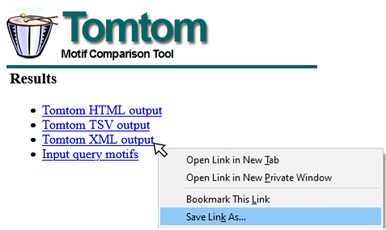

```{r, include = FALSE}
knitr::opts_chunk$set(
  collapse = TRUE,
  comment = "#>"
)
```

TomTom is a tool for comparing motifs to a known set of motifs. It takes as
input a set of motifs and a database of known motifs to return a ranked list of
the significance of the match between the input and known motifs. TomTom can be
run using the `runTomTom()` function.

```{r setup}
library(memes)
library(magrittr)
```

## Accepted database formats

`runTomTom()` can accept a variety of inputs to use as the "known" motif database. The formats are as follows:
 - a path to a .meme format file (eg `"fly_factor_survey.meme"`)
 - a list of universalmotifs
 - the output object from `runDreme()`
 - a `list()` of all the above. If entries are named, `runTomTom()` will use those names as the database identifier

### Setting a default database 

memes can be configured to use a default .meme format file as the query
database, which it will use if the user does not provide a value to `database`
when calling `runTomTom()`. The following locations will be searched in order:

1. The `meme_db` option, defined using `options(meme_db = "path/to/database.meme")`
 - The `meme_db` option can also be set to an R object, like a universalmotif list.
2. The `MEME_DB` environment variable defined in `.Renviron`
 - The `MEME_DB` variable will only accept a path to a .meme file

**NOTE:** if an invalid location is found at one option, `runTomTom()` will fall
back to the next location if valid (eg if the `meme_db` option is set to an
invalid file, but the `MEME_DB` environment variable is a valid file, the
`MEME_DB` path will be used.

```{r}
options(meme_db = system.file("extdata/db/fly_factor_survey_id.meme", package = "memes"))
```
 
 
## Input types

To use TomTom on existing motifs, `runTomTom()` will accept any motifs in
`universalmotif` format. The `universalmotif` package provides several utilities
for importing data from various sources.
```{r, eval=F}
library(universalmotif)
example_motif <- create_motif("CCRAAAW")
runTomTom(example_motif)
```

`runTomTom()` can also take the output of `runDreme` as input. This allows users
to easily discover denovo motifs, then match them to as set of known motifs.
When run on the output of `runDreme`, all `runTomTom()` output columns will be
appended to the `runDreme()` output data.frame, so no information will be lost. 
```{r, eval=F}
data("dreme_example")
runTomTom(dreme_example) 
```

## Output data
```{r}
# This is a pre-build dataset packaged with memes 
# that mirrors running:
# options(meme_db = system.file("inst/extdata/db/fly_factor_survey_id.meme", package = "memes"))
# example_motif <- create_motif("CCRAAAW")
# example_tomtom <- runTomTom(example_motif)
data("example_tomtom")
```

When run using a `universalmotif` object as input, `runTomTom` returns the following columns:
```{r}
names(example_tomtom)
```

Columns preappended with `best_` indicate the data corresponding to the best match to the motif listed in `name`.

The `tomtom` column is a special column which contains a nested `data.frame` of
the rank-order list of TomTom hits for the motif listed in `name`. 
```{r}
names(example_tomtom$tomtom[[1]])
```

The `best_match_motif` column contains the universalmotif representation of the best match motif.
```{r, fig.height=2, fig.width=5}
library(universalmotif)
view_motifs(example_tomtom$best_match_motif)
```

The `match_motif` column of `tomtom` contains the universalmotif format motif
from the database corresponding to each match in descending order.
```{r, fig.height=3, fig.width=5}
example_tomtom$tomtom[[1]]$match_motif[1:2] %>% 
  view_motifs()
```


The `drop_best_match()` function drops all the `best_match_*` columns from the `runTomTom()` output.
```{r}
example_tomtom %>% 
  drop_best_match() %>% 
  names
```

To unnest the `tomtom` data.frame column, use `tidyr::unnest()`. The
`drop_best_match()` function can be useful when doing this to clean up the
unnested data.frame.
```{r}
unnested <- example_tomtom %>% 
  drop_best_match() %>% 
  tidyr::unnest(tomtom) 
names(unnested)
```

To re-nest the tomtom results, use `nest_tomtom()` (Note: that `best_match_`
columns will be automatically updated based on the rank-order of the `tomtom`
data.frame)

```{r}
unnested %>% 
  nest_tomtom() %>% 
  names
```

### Manipulating the assigned best match

While TomTom can be useful for limiting the search-space for potential true
motif matches, often times the default "best match" is not the correct
assignment. Users should use their domain-specific knowledge in conjunction with
the data returned by TomTom to make this judgement (see below for more details).
memes provides a few convenience functions for reassigning these values.

First, the `update_best_match()` function will update the values of the
`best_match*` columns to reflect the values stored in the first row of the
`tomtom` data.frame entry. This means that **the rank of the `tomtom` data is
meaningful**, and users should only manipulate it if intending to create
side-effects.

If the user can force motifs to contain a certain motif as their best match
using the `force_best_match()` function. `force_best_match()` takes a named
vector as input, where the name corresponds to the input motif `name`, and the
value corresponds to a `match_name` found in the `tomtom` list data (**NOTE:**
this means that users cannot force the best match to be a motif that TomTom did
not return as a potential match).

For example, below the example motif could match either "Eip93F_SANGER_10", or "Lag1_Cell".
```{r}
example_tomtom$tomtom[[1]] %>% head(3)
```

The current best match is listed as "Eip93F_SANGER_10".
```{r}
example_tomtom %>% 
  dplyr::select(name, best_match_name)
```

To force "example_motif" to have the best match as "Lag1_Cell", do the following:
```{r}
new_tomtom <- example_tomtom %>% 
  # multiple motifs can be updated at a time by passing additional name-value pairs.
  force_best_match(c("example_motif" = "Lag1_Cell"))
```

The `best_match_*` columns will be updated to reflect the modifications.
```{r}
# original best match:
example_tomtom$best_match_name
# new best match after forcing:
new_tomtom$best_match_name
```
 
## Visualize data

`view_tomtom_hits()` can be used to compare the hits from tomtom to each input
motif. Hits are shown in descending order by rank. By default, all hits are
shown, or the user can pass an integer to `top_n` to view the top number of
motifs. This can be a useful plot for determining which of the matches appear to
be the "best" hit. 

For example, it appears that indeed "Eip93F_SANGER_10" is the best of the top 3
hits, as most of the matching sequences in the "Lag1_Cell" and "pho_SOLEXA_5"
motifs correspond to low information-content regions of the matched motifs.
```{r, fig.height=4, fig.width=5}
example_tomtom %>% 
  view_tomtom_hits(top_n = 3)
```

## Importing previous data

`importTomTomXML()` can be used to import a `tomtom.xml` file from a previous
run on the MEME server or on the commandline. Details for how to save data from
the TomTom webserver are below.

### Saving data from TomTom Web Server
To download XML data from the MEME Server, right-click the TomTom XML output link
and "Save Target As" or "Save Link As" (see example image below), and save as
`<filename>.xml`. This file can be read using `importTomTomXML()`



# Citation

memes is a wrapper for a select few tools from the MEME Suite, which were
developed by another group. In addition to citing memes, please cite the MEME
Suite tools corresponding to the tools you use.

If you use `runTomTom()` in your analysis, please cite:

Shobhit Gupta, JA Stamatoyannopolous, Timothy Bailey and William Stafford Noble, "Quantifying similarity between motifs", Genome Biology, 8(2):R24, 2007. [full text](http://genomebiology.com/2007/8/2/R24)

## Licensing Restrictions
The MEME Suite is free for non-profit use, but for-profit users should purchase a
license. See the [MEME Suite Copyright Page](http://meme-suite.org/doc/copyright.html) for details.
